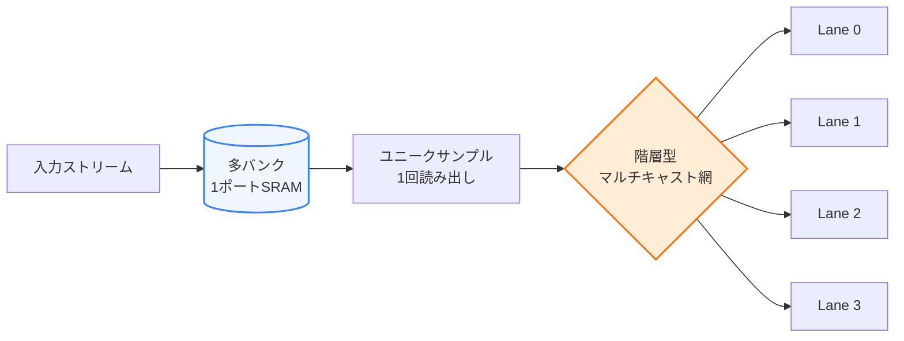
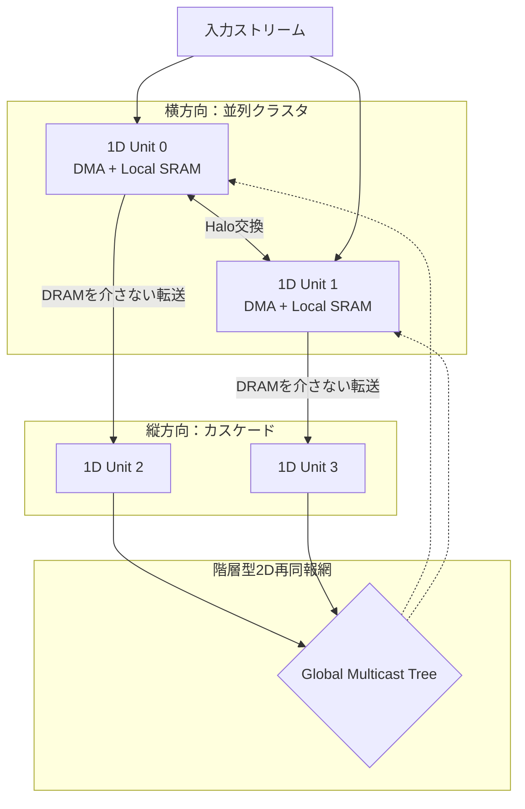

# 1Dストリーミング型 複素数データフローアクセラレータ

> 多バンクSRAMの静的データ配置と、重複窓を排除するマルチキャスト配線を直結した、局所ステンシル／複素数演算向けアクセラレータの構成案。

| 項目 | 内容 |
|---|---|
| ステータス | 中核スケジューラ検証済み／全体は構成案 |
| バージョン | 0.1 |
| 文書日 | 2026-08-27 |
| 公開目的 | Defensive Publication（第三者による排他的独占の防止） |
| 作者の方針 | 特許取得・製造・収益化を目的としない |

> [!IMPORTANT]
> 12-bank／4-wayスケジューラはRTL simulation、形式検証、generic synthesisを通過済みです。複素MAC、SRAMマクロ、DMA、NoCおよび配置配線を含む全チップの検証結果ではありません。

## 概要

本提案の目的は、1D／局所ステンシル計算および複素数データフロー演算において、次のコストを削減することです。

- SRAM内のデータをセル間でシフトするための電力と配線
- 複数レーンが要求する重複データの多重読み出し
- 中間結果を外部DRAMへ書き戻す帯域
- 外部DRAMの待ち時間による演算器の停止

中核となる考え方は、**多バンク化したSRAMにデータを静的配置し、1回だけ読み出したユニークなサンプルを、演算器直前の配線網で複数レーンへ同報すること**です。

## English abstract

This document proposes a streaming accelerator for complex-valued local-stencil workloads. Complex FP16 samples are statically distributed across skew-addressed, single-port SRAM banks; unique samples are read once and multicast directly to overlapping compute lanes. The baseline example uses 12 banks, four lanes, a three-point stencil, and six unique reads per cycle. Conflict-free prefetch writes, physical timing, power, area, and large-scale multicast remain implementation-dependent and require RTL and physical-design validation.

### Core construction

The disclosed construction directly combines: (1) statically placed data in independently addressable SRAM banks, (2) elimination of duplicate reads across overlapping stencil windows, and (3) a multicast network that routes each unique SRAM output to every consuming lane. “Zero data movement” means that samples are not shifted or relocated between SRAM cells; normal SRAM reads and signal propagation still occur.

For logical buffer $b$, the concrete bank and in-bank address mappings are:

$$
B_b(x,y)=(x+2y+\phi_b)\bmod M
$$

$$
A_b(x,y)=base_b+y\frac{W_p}{M}+\left\lfloor\frac{x}{M}\right\rfloor
$$

Here, $M$ is the number of single-port banks, $W_p$ is a padded row width divisible by $M$, and $base_b$ selects a non-overlapping depth range for each logical buffer.

### Concrete four-lane embodiment

Four adjacent three-tap lanes logically request 12 samples per issue, but their union contains only six consecutive samples. The baseline uses $M=12$, buffer phases $\phi_A=0$ and $\phi_B=6$, six reads from the active buffer, and four prefetch writes to the opposite buffer. The two access sets are disjoint in every steady-state cycle; swapping the read and write buffers preserves the same half-ring phase separation. The six samples are routed so that Lane $j$ receives $(s_j,s_{j+1},s_{j+2})$.

### Scalable embodiment

For $N\ge1$ adjacent lanes and a contiguous $T$-tap stencil, the number of unique reads is $U=N+T-1$. A symmetric conflict-free ping-pong family is obtained with $M=2U$ single-port banks and phases $\phi_A=0$, $\phi_B=U$. The repository tests both buffer directions for $N=1,2,4,8,16,32$ with $T=3$. The $N=4$ member is exactly the 12-bank baseline; $N=0$ denotes an idle or power-gated state rather than a compute configuration.

### Extension candidates

The same unit may be extended horizontally as distributed-memory clusters with direct halo exchange, vertically as cascaded pipeline stages that forward intermediate results without external-DRAM writeback, and globally through a buffered hierarchical multicast or NoC re-broadcast tree. These are disclosed architectural extensions, not validated claims of constant-frequency arbitrary-$N$ scaling or one-cycle full Self-Attention.

### Verification boundary

The bank scheduler has passed Python reference tests, exhaustive RTL simulation of its 36 periodic states, Yosys SAT proof of zero read/write conflicts for all scheduler inputs, and generic synthesis checks. This verifies the scheduler construction, not a complete chip. Complex MAC arithmetic, compiled SRAM macros, DMA, NoC, timing closure, physical fan-out, power, and full multidimensional scaling remain outside the verified implementation.

**Keywords:** banked SRAM, skewed banking, streaming stencil, overlap elimination, multicast, complex MAC, ping-pong buffer, dataflow accelerator, halo exchange, hierarchical multicast.

## クイック検証

```shell
python tools/verify.py
python tools/verify.py --bootstrap
```

1行目はPython検証のみ、2行目は固定版の[YosysHQ OSS CAD Suite](https://github.com/YosysHQ/oss-cad-suite-build)（約0.5〜0.75 GB）をSHA-256照合後にuser cacheへ展開し、RTL simulation、形式検証、generic synthesisまで実行します。結果は `build/verification-report.json` に保存されます。

## 1. 基本アーキテクチャ

データそのものをSRAMセル間で順次シフトさせる代わりに、必要なアドレスを読み出し、その出力を分岐配線で複数の演算レーンへ供給します。



「データ移動ゼロ」は、**SRAMセル間のシフト／再配置を行わない**という意味です。SRAMの読み出しと配線上の信号伝搬そのものは発生します。

## 2. 基本1Dユニット

### 2.1 データ形式

- 1サンプル：4 byte
- 実部：FP16（2 byte）
- 虚部：FP16（2 byte）
- 表現：`complex<FP16, FP16>`

丸め、非正規化数、NaN、飽和、内部累積精度は実装時に別途定義します。

### 2.2 SRAMバンク構成

- 物理バンク数：12
- 各バンク：1ポートSRAM
- 1バンクあたり最大1アクセス／cycle
- バンク選択式：

$$
B(x,y)=(x+2y)\bmod 12
$$

同一行で連続する最大12個の $x$ は異なるバンクへ割り当てられます。行が変わるたびに開始バンクを2つずらし、2次元タイルでの規則的な偏りを抑えます。

### 2.3 重複窓の排除

4レーンが隣接する出力点に対して3点ステンシルを同時処理する例を示します。

| レーン | 必要な入力窓 |
|---|---|
| Lane 0 | $x-1, x, x+1$ |
| Lane 1 | $x, x+1, x+2$ |
| Lane 2 | $x+1, x+2, x+3$ |
| Lane 3 | $x+2, x+3, x+4$ |

論理要求は $4\times3=12$ サンプルですが、集合として必要なのは次の6サンプルです。

$$
\{x-1,x,x+1,x+2,x+3,x+4\}
$$

したがって、同一行の6サンプルを各1回だけ読み出し、配線網で必要なレーンへ分岐すれば、物理読み出しを **12回から6回へ圧縮**できます。

### 2.4 物理アクセス計画

基本候補は次のとおりです。

| 種別 | アクセス数／cycle | 帯域（1 GHz時） |
|---|---:|---:|
| 重複排除後の読み出し | 6 | 24 GB/s |
| 次タイルの先読み書き込み | 4 | 16 GB/s |
| 合計 | 10 | 40 GB/s |
| 12バンクの理論上限 | 12 | 48 GB/s |

クロック周波数を $f$ GHzとした場合、合計オンチップ帯域は $40f$ GB/sです。

ただし、**総アクセス数が12以下であることは、1ポートSRAMでの無衝突を保証しません**。cycle $t$ の読み出しバンク集合を $R_t$、書き込みバンク集合を $W_t$ とすると、少なくとも次の条件が必要です。

$$
|R_t|=6,\quad |W_t|=4,\quad R_t\cap W_t=\varnothing
$$

6個の連続読み出しは互いに異なるバンクへ配置できます。読み書きの分離は、次節のbuffer phaseを用いた具体的スケジュールで実現します。

### 2.5 実施可能な無衝突スケジュール

12個の物理バンクを増やさず、同じバンク群の異なる深さに2個の論理バッファを置く具体例を定義します。バッファごとのbank phase $\phi_b$ を加えます。

$$
B_b(x,y)=(x+2y+\phi_b)\bmod 12
$$

$$
\phi_A=0,\qquad \phi_B=6
$$

パディング後の行幅 $W_p$ を12の倍数とし、バンク内アドレスを次のように定義します。

$$
A_b(x,y)=base_b+y\frac{W_p}{12}+\left\lfloor\frac{x}{12}\right\rfloor
$$

これにより $(B_b,A_b)$ の組が各サンプルを一意に指定します。$base_A$ と $base_B$ は同じ物理バンク内の重ならない深さを指します。

定常cycle $t$ では、現在バッファから $x=4t\ldots4t+5$ の6サンプルを読み、次バッファへ $x=4t\ldots4t+3$ の4サンプルを書きます。読み書きは同じローカル行 $y$ を対象とします。$y=0$、Aを読みBへ書く場合のbank割り当ては次のとおりです。

| $t\bmod3$ | 読み出しbank（6本） | 書き込みbank（4本） | idle bank |
|---:|---|---|---|
| 0 | 0, 1, 2, 3, 4, 5 | 6, 7, 8, 9 | 10, 11 |
| 1 | 4, 5, 6, 7, 8, 9 | 10, 11, 0, 1 | 2, 3 |
| 2 | 8, 9, 10, 11, 0, 1 | 2, 3, 4, 5 | 6, 7 |

Bを読みAへ書く場合も、位相差は $-6\equiv6\pmod{12}$ となるため同様に無衝突です。異なる行を同時に読み書きする場合は、$2(y_w-y_r)$ を含めて書き込み開始phaseを再計算するか、行切替cycleを設けます。

行端ではHaloを含むローカル座標へ変換し、4レーン境界および12バンク境界をpaddingします。定常部以外のHalo投入はprologue／epilogue cycleで処理します。

### 2.6 cycle単位のデータ経路

1-cycle read latencyの同期SRAMを想定した最小パイプラインは次のとおりです。

1. **P0 — Address:** 6 bankへread command、重ならない4 bankへDMA FIFOからwrite commandを発行
2. **P1 — SRAM:** 6サンプルを出力レジスタへ格納
3. **P2 — Multicast:** サンプル $s_0\ldots s_5$ を各レーンへ配線
4. **P3 — Compute:** Lane $j$ が $(s_j,s_{j+1},s_{j+2})$ を処理
5. **P4 — Output:** 結果を独立した出力FIFOまたは次段ユニットへ送出

出力は基本データSRAMへ同一cycleに書き戻さないものとします。書き戻す場合は、独立した出力バンク、追加ポート、または別cycleが必要です。係数は小容量の係数レジスタに常駐させ、上表の10アクセスには含めません。

### 2.7 1-way／2-way／N-wayの実施形態

連続する $N$ レーンと $T$ tapのステンシルに一般化します。レーン番号は `Lane 0` から `Lane N-1` とし、実動構成は $N\ge1$ です。$N=0$ はclock／power gatingされた停止状態であり、演算構成には数えません。

論理要求数は $NT$、重複排除後のユニーク読み出し数 $U$ は次式です。

$$
U=N+T-1
$$

対称なping-pong動作を単一ポートbankで成立させる具体的なbank familyを次のように定義します。

$$
M=2U=2(N+T-1)
$$

$$
B_b(x,y)=(x+2y+\phi_b)\bmod M,\qquad
\phi_A=0,\quad\phi_B=U
$$

読み出し側は連続する $U$ bank、書き込み側は反対側の半周から連続する $N$ bankを使用します。役割を交換しても位相差は半周の $U$ のままなので、両方向で無衝突です。padding後の行幅 $W_p$ は $M$ の倍数とし、bank内アドレスは次式で与えます。

$$
A_b(x,y)=base_b+y\frac{W_p}{M}+\left\lfloor\frac{x}{M}\right\rfloor
$$

3 tap（$T=3$）の具体例は次のとおりです。

| レーン数 $N$ | 論理要求 $3N$ | unique read $N+2$ | prefetch write $N$ | bank数 $2N+4$ | idle |
|---:|---:|---:|---:|---:|---:|
| 1 | 3 | 3 | 1 | 6 | 2 |
| 2 | 6 | 4 | 2 | 8 | 2 |
| 4 | 12 | 6 | 4 | 12 | 2 |
| 8 | 24 | 10 | 8 | 20 | 2 |
| $N$ | $3N$ | $N+2$ | $N$ | $2N+4$ | 2 |

1-wayは重複共有を持たない最小実施形態、2-way以上は隣接窓の共有による読み出し圧縮を持つ実施形態です。`reference/bank_schedule.py` は $N=1,2,4,8,16,32$ の両ping-pong方向を検証します。12-bank／4-way構成は、この一般式の $N=4,T=3$ に一致します。

## 3. 演算レーン

論理出力レーンを4個配置します。物理MAC数は、面積優先とスループット優先の2構成を明確に分けます。

| 構成 | 物理演算器 | 3点ステンシルの出力率 | 1 GHz時のピーク |
|---|---:|---:|---:|
| MAC-4（面積優先） | 4 complex MAC | 4出力／3 cycle | 32 GFLOP/s |
| STENCIL-4（帯域整合） | 12 complex MAC相当 | 4出力／cycle | 96 GFLOP/s |

1 complex MACを、複素乗算の4乗算＋2加算と複素累積の2加算を合わせた8 real FLOPとして数えます。MAC-4では各レーンが3 tapを3 cycleで逐次処理し、6サンプルはoperand registerに保持します。STENCIL-4では各レーンに3 tap分の演算器と加算木を置き、6 read/cycleのメモリ供給率に一致させます。

したがって、**4個のcomplex MACだけで4個の3点ステンシル結果を毎cycle生成することはできません**。FMAの数え方や回路構成で公称値は変わるため、性能値には構成名と演算カウント規約を併記します。

## 4. マルチキャスト網

SRAMから読み出した6サンプルを、各レーンが必要とする入力ポートへ配信します。4レーン程度では直接分岐も候補ですが、レーン数を増やす場合は次の構成を想定します。

- バッファ付き配線ツリー
- レジスタ挿入によるパイプライン化
- 複数クラスタへの階層型マルチキャスト
- クロック領域／電圧領域をまたぐ場合の明示的なブリッジ

レーン数を任意の $N$ へ拡張できるのは**論理構造上**の性質です。実際の上限は配線遅延、fan-out、消費電力、クロック、面積によって決まります。

## 5. 多次元への拡張候補



### 5.1 横方向：分散メモリ型メニコア

1Dユニットを横に並べ、タイルを分担します。

- 各ユニット／クラスタに専用DMAを配置
- 外部DRAMのチャネルまたはアドレス領域を論理的に分割
- 境界のHaloデータを隣接リンクで直接交換
- 4 → 16 → 64ユニットの順で段階的にスケールを評価

「各ユニットに局所DRAMを持つ」構成は、外付けDRAM、積層DRAM、eDRAM、共有DRAMの論理分割など複数の実装候補を含みます。DRAMを各ユニットと同一ダイ上に置けることを前提にはしません。

### 5.2 縦方向：カスケード型パイプライン

前段ユニットの出力を外部DRAMへ書き戻さず、次段ユニットの入力SRAMまたはFIFOへ直接転送します。中間結果の外部帯域を削減できますが、段ごとの処理量が異なる場合はバッファ容量とバックプレッシャ制御が必要です。

### 5.3 2D再同報

複数クラスタで共有する特徴量を階層型ネットワークで再配信する構想です。単一の巨大な全域バスではなく、物理距離に応じて分割された配信ツリーまたはNoC multicastを基本候補とします。

再同報網はSelf-AttentionにおけるKey／Value等の配信を支援できますが、**任意サイズのSelf-Attention全体を1 cycleで完了させることを意味しません**。全相関計算には問題サイズに応じた演算器数、$O(N^2)$規模のデータ交換、リダクション、Softmax等が必要です。

## 6. DRAM待ち時間の隠蔽

時間ブロッキング深さ $K=4$ を初期候補とし、演算と次タイルの先読みをping-pongバッファで重ねます。完全に隠蔽できる条件は次のとおりです。

$$
T_{compute}\ge T_{prefetch}
$$

実効DRAM帯域を $B_{dram}$、次タイルの転送量を $D_{tile}$ とすると、概算は次式です。

$$
T_{prefetch}\approx \frac{D_{tile}}{B_{dram}}+T_{setup}
$$

$B_{dram}=50$ GB/sは評価例であり、隠蔽の成立にはタイル寸法、Halo、書き戻し量、DMA起動時間、バースト効率を含めた測定が必要です。

## 7. 検証状況

完了済み：

- [x] 12-bank／4-wayの定常無衝突scheduleとバンク内アドレス一意性
- [x] 1／2／4／8／16／32-way一般式の両ping-pong方向（Python 12テスト）
- [x] 全36周期状態のRTL simulation
- [x] 全入力状態のYosys SAT無衝突証明
- [x] generic synthesis、latch不在、構造check
- [x] SHA-256検証付きtoolchain bootstrapとJSON report生成

未検証なのは、行端／Halo、異なる行の同時アクセス、複素MACとSRAMを含む統合RTL、FP16数値規則、PDK依存のSTA／配置配線／電力、DRAM／DMAおよびNoCです。これらと実機製造は、本Defensive Publicationの完成条件には含めません。

## 8. 公開範囲と制約

本提案の中心は、次の組み合わせです。

1. スキュー配置された多バンク・スタティックメモリ
2. 隣接ステンシル窓の重複を除去する読み出しスケジュール
3. ユニークな読み出しデータを複数演算レーンへ直接配信するマルチキャスト網
4. 横方向のHalo交換、縦方向のカスケード、階層型の再同報への拡張

一方、次の事項は検証済みの性能保証ではありません。

- 任意の $N$ で一定クロックを維持できること
- すべての読み書きパターンで無条件にバンク衝突がないこと
- 外部DRAM待ち時間を常に完全隠蔽できること
- 任意サイズのSelf-Attentionを1 cycleで完了できること
- 動的に最適解へ収束すること

## 9. Defensive Publicationについて

本リポジトリは、作者による特許取得、製造、収益化ではなく、具体的かつ追試可能な技術開示によって第三者の後発的な独占を防ぐことを目的とします。公開時は内容を固定したGitHub Releaseを作成し、commit hashと公開日時を保持し、可能ならDOI付き外部archiveにも保存します。

> [!NOTE]
> 公開は特許権や一律の無効効果を発生させるものではなく、先行技術としての効果は公開時期、開示内容、到達可能性、法域および対象クレームごとに判断されます（[JPO](https://www.jpo.go.jp/system/laws/rule/guideline/patent/tukujitu_kijun/ht/03_0200.html)、[WIPO](https://www.wipo.int/en/web/patents/faq_patents)）。本節は法的助言ではありません。

## 10. ライセンス / License

- `reference/`、`rtl/`、`tools/`、`tests/`およびその他のソースコード：
  [Apache License 2.0](LICENSE)
- `README.md`の本文およびオリジナル図：
  [Creative Commons Attribution 4.0 International](LICENSE-DOCUMENTATION.md)

Copyright © 2026 Hiroshi Namiki.
