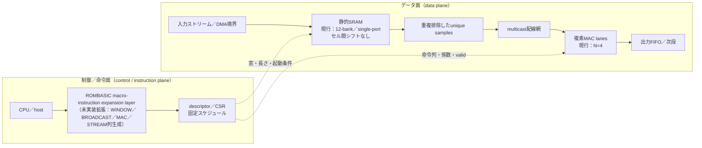
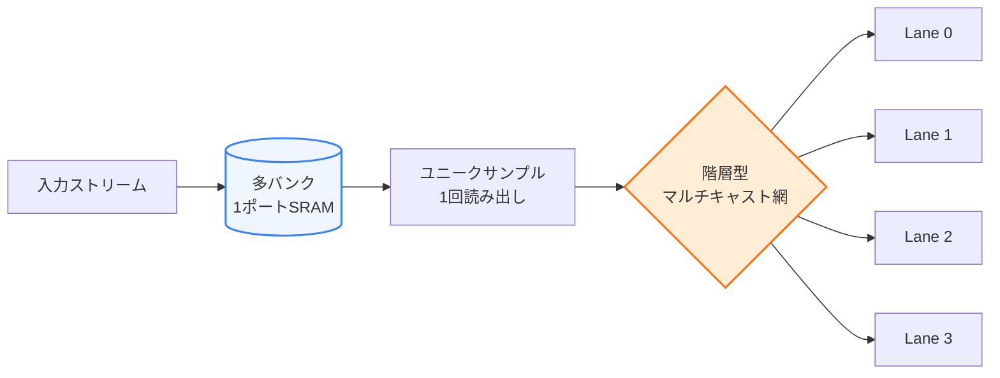
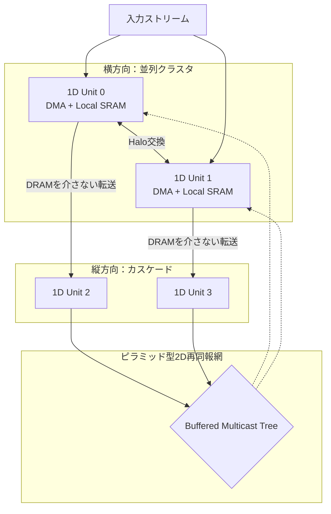
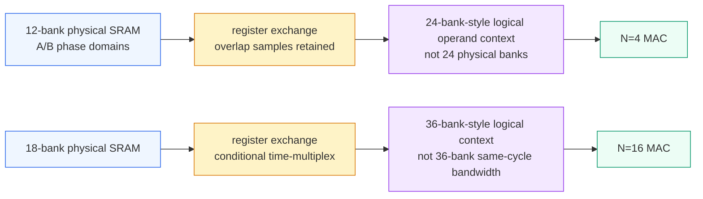
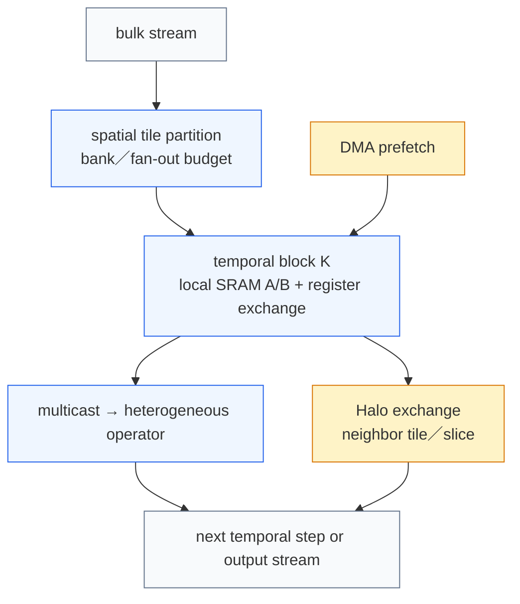
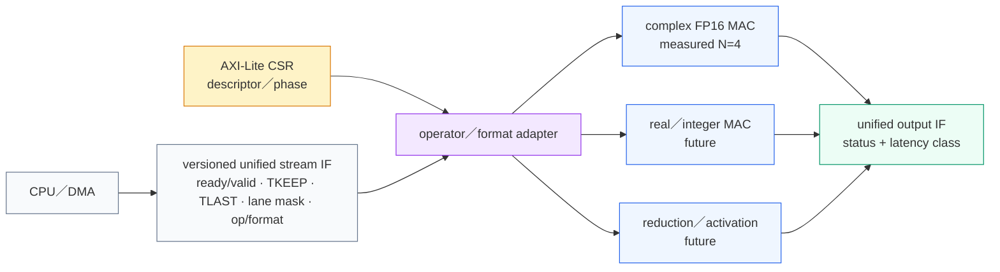
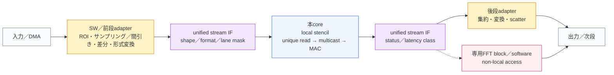
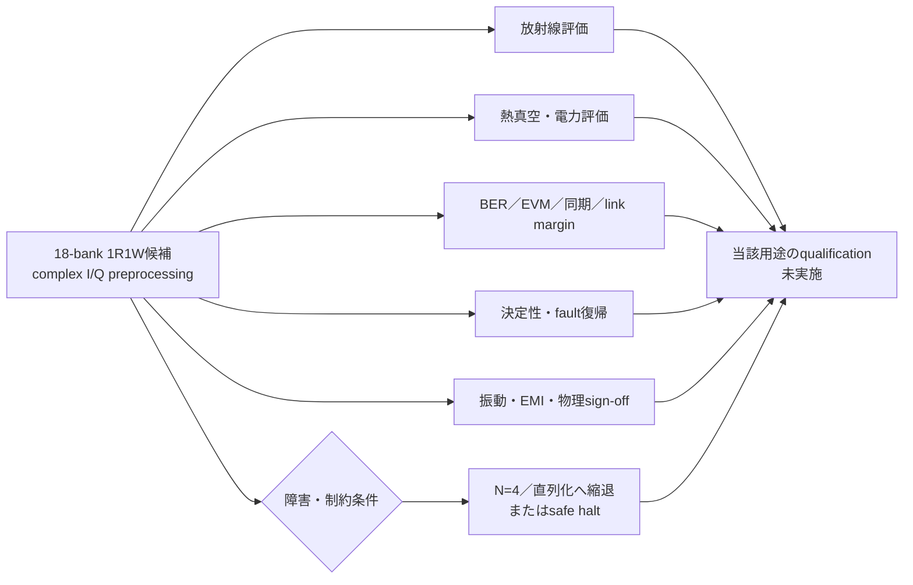

# 固定遅延型 1Dストリーミング複素数データフロー・コプロセッサ

> 多バンクSRAMの静的データ配置と、重複窓を排除するマルチキャスト配線を直結した、局所ステンシル／複素数演算向けの公開構成案です。現行の実証結果と、将来の拡張候補を同じリポジトリ内で明確に分離しています。

[](https://doi.org/10.5281/zenodo.22155033)

[日本語](README.md) · [English](README.en.md) · [简体中文](README.zh-Hans.md)

> 全バージョンを指す概念DOIは[10.5281/zenodo.22155033](https://doi.org/10.5281/zenodo.22155033)です。版ごとのDOIは対応するZenodo recordと`CITATION.cff`に記録されます。

> [!NOTE]
> `v0.1.0`は初期開示、`v0.2.0`は追試証跡と将来展望、`v0.3.0`は本説明更新を固定したimmutable releaseです。内容固定はチップsign-off、製造可能性、または性能保証を意味しません。

| 項目 | 内容 |
|---|---|
| 現行の事実 | `N=4` lanes／`M=12` single-port banksのreference、RTL、formal、および探索的physical evidence |
| 文書版 | `v0.3.0` immutable release（Zenodo Concept DOI） |
| 文書日 | 2026-08-30 |
| 公開目的 | Defensive Publication（第三者による排他的独占の防止） |
| 作者の方針 | 特許取得・製造・収益化を目的としない |

> [!IMPORTANT]
> 本文の「固定遅延」は、データがオンチップSRAMにあり、規則区間でbackpressureと外部DRAM待ちを除いた決定性レイテンシを指します。DRAM待ち、AXI／FIFO backpressure、prologue／epilogue、未実装のROMBASIC制御層まで含むエンドツーエンド固定遅延は主張しません。

## 読み方：制御／命令面とデータ面

制御面は実行する窓、同報、MAC、ストリーム長などのスケジュールを記述し、データ面はそのスケジュールに従ってサンプルを流します。**現行の測定対象はデータ面の`N=4`構成です。** ROMBASICは、CPUから受けた高水準記述を命令列へ展開する将来の制御層であり、現行RTLには実装されていません。



ROMBASIC macro-instruction expansion layer（ROMBASICマクロ命令展開層）は、単なるBASICインタプリタではなく、`WINDOW`／`BROADCAST`／`MAC`／`STREAM`命令列を生成する制御層の**構想**です。これは規則区間の決定性レイテンシを目指す未実装拡張であり、現行の`N=4`実測値には含めません。

窓の重複がなぜデータ移動・重複読出し・bank競合として現れるのかは、独立した[ステンシル窓の再定式化（日本語）](docs/concepts/stencil-window-reframing.md)で図解しています。英語版は[English](docs/concepts/stencil-window-reframing.en.md)、簡体字版は[简体中文](docs/concepts/stencil-window-reframing.zh-Hans.md)です。

## 大規模な規則データで効く理由

- 隣接する`N`レーンと`T` tapの窓は、論理要求`N*T`個に対して`U=N+T-1`個のunique sampleだけを必要とします。
- SRAMセル間のシフト／再配置をせず、同じサンプルを一度読み出してmulticastするため、重複読み出しとデータ移動を減らせます。
- `B(x,y)=(x+2y+phase) mod M`のような静的配置と、compile-timeに決めたbank集合により、規則区間のアクセス順序を事前に検査できます。
- CPU／制御面とデータ面を分けることで、規則区間では命令発行を毎サンプルに介在させず、DMA／DRAMの待ちをバッファ側へ隔離できます。

本方式は、窓を構成するための生成・シフト・書き戻し・再読出しをデータ面の必須工程にせず、並列結果を定量的なbeat列としてFIFOへ受け渡せます。これは速度保証ではありませんが、規則区間の定常操作数とセル間データ移動を減らせる構造であり、残るSRAM・multicast・FIFOの資源負担を別段へ隠さず明示的に扱います。

ここでの優位はMACの演算率そのものではありません。2Dの同条件referenceでは、ラインバッファと本方式が同じcore出力率・同じ最終結果になります。本方式は、窓のシフト／再配置をデータ面から外し、SRAM供給と演算を重畳できる余地を持つ点が優位です。一方、loadを直列化すれば本方式が速くなるわけではなく、FPGAのFmax・配線・電力を含む優劣は未測定です。外部の測定方法と比較条件は[電力・データ移動の外部参考文献](docs/concepts/energy-measurement-references.md)に整理しています。

現行baselineが**single-port SRAMにこだわる**のは、true-dual-portの帯域で成立させるのではなく、一般的な1ポートbankを複数配置し、cycleごとのread／write bank集合を互いに素にできることを示すためです。したがって、ユニットを複製する場合も、入力分割・bank集合・DMA／FIFOの競合を別途検査する必要があります。18-bank 1R1Wのregister-exchange案はこのbaselineを置き換えるものではなく、別の将来候補です。

不規則なアドレス、短い仕事、頻繁な分岐、backpressureが支配的な場合に同じ効果や固定遅延が得られるとは限りません。これは一般的な高速化保証ではなく、規則性の高い局所データフローに対する設計上の利点です。

> [!NOTE]
> 記号`N`はレーン数、`M`はbank数です。したがって現行の実証は「`N=4`／`M=12`（12-bank baseline）」であり、`N=12`レーンを実証済みとは扱いません。`N=12`レーンは一次試算、`M=12`の実証範囲は現行baselineとして別に記載します。

## 検証の順序：N=4実測 → N=6／N=16試算 → 検証境界

### 1. N=4／M=12：現行の実測・証跡

現行baselineは、`T=3`、4 lanes、12 single-port banks、6 unique reads／cycleを用います。4レーンのend-to-end reference RTLでは、入力・window・multicast・MAC・outputの段を再生でき、`nostall`時の定常出力間隔は3 cycleです。物理runはSKY130の4 MHz探索であり、hold／antenna／SRAM内部sign-offを閉じたチップではありません。

| 面 | 現行baselineで確認した範囲 | 根拠 |
|---|---|---|
| reference／schedule | 6 read＋4 writeのbank集合、両buffer方向、行端／Haloの境界 | [`reference/bank_schedule.py`](reference/bank_schedule.py)、[`reference/peripheral_schedule.py`](reference/peripheral_schedule.py)、[`tools/verify.py`](tools/verify.py) |
| 2D方式比較 | 同じ密な2D複素タイルを3×3で処理するline-buffer／banked multicast reference、最終出力digest一致、cycle／アクセス指標。2D候補は18 unique readを無衝突化するM=36拡張として扱う | [`reference/two_d_dataflow.py`](reference/two_d_dataflow.py)、[`tools/compare_2d_dataflows.py`](tools/compare_2d_dataflows.py)、[1024×1024証跡](physical/evidence/2d-dataflow-comparison-1024.json)、[`VALIDATION.md`](VALIDATION.md) |
| RTL／formal | 同期1-port SRAM、6→4×3 multicast、複素MAC、FIFO／CSR／MBIST、bank conflict SAT、入力loadのsimulation-only assert | [`rtl/banked_stencil_engine.sv`](rtl/banked_stencil_engine.sv)、[`rtl/axis_fifo.sv`](rtl/axis_fifo.sv)、[`rtl/tb_banked_stencil_engine.sv`](rtl/tb_banked_stencil_engine.sv)、[`rtl/tb_banked_stencil_path.sv`](rtl/tb_banked_stencil_path.sv)、[`VALIDATION.md`](VALIDATION.md) |
| physical | 4 MHz制約での探索的到達性。100 MHz sign-offやSRAM内部sign-offは未完了 | [`physical/evidence/RTL-PERFORMANCE-REPORT.md`](physical/evidence/RTL-PERFORMANCE-REPORT.md)、[`physical/evidence/PHYSICAL-VERIFICATION-REPORT.md`](physical/evidence/PHYSICAL-VERIFICATION-REPORT.md) |

### 2. N=6／M=16：一次試算（未実装の展望）

`T=3`、single-port、連続窓、同一行、ping-pongという前提では、`U=N+T-1=8`、`M=2U=16`、read=8、write=6、phase差=8です。理想出力率は4-lane比1.5倍ですが、配線、SRAM macro、物理タイミング、電力を含むN=6 RTL／physical結果ではありません。行幅のpadや帯域は、入力幅とtile境界を明示した上で別途計算します。

### 3. N=16／M=36：数学的導出（未実装の展望）

同じ`T=3`、single-port、連続窓、ping-pong、同一行の前提で、`U=18`、`M=36`、phase差=18です。読み出し集合を連続18 bank、書き込み集合をその半周後の連続16 bankとすれば、`R_t∩W_t=∅`であり、buffer役割を交換しても同じ半周差が保たれます。これは無衝突条件の数学的導出であって、16-lane RTL、formal、backpressure、配線、P&R、実測性能の証明ではありません。候補の数値と検証ゲートは[設計空間試算資料](docs/13-design-space-exploration.md)と[候補JSON](manufacturing/candidate-n16.json)に分離しています。

### 4. 検証境界

| 分類 | このリポジトリでの位置づけ | 主張しないこと |
|---|---|---|
| **検証済み** | `N=4`／`M=12`のreference／RTL／formal、64 Python tests、2D referenceの最終出力digest一致、入力load bank uniqueness assert、複素MAC 256 vectors、FIFO／CSR／MBIST、基準engine性能、SKY130 4 MHz探索run | `N=6`／`N=12`／`N=16`の実装性能、100 MHz全corner、製造sign-off |
| **一次試算** | `N=6`／`N=12`／`N=16`の容量・帯域・重複削減・endpoint・理想MAC、`N=16`の制約付き候補選定、idle bankの均熱／gating余地 | 実配線遅延、実電力、実面積、SRAM macroの動作余裕 |
| **未検証** | N-way parameterized RTL／formal、直接配線とpyramidの比較、外部DMA／NoC、gate-level、qualified SRAM、実機、idle bankの温度・電力効果 | 数値を製品保証や一意の最適解として扱うこと |

## クイック検証

```shell
python tools/verify.py
python tools/verify.py --bootstrap --require-rtl
python tools/measure_performance.py --report physical/evidence/rtl-performance-report-20260829.json
python tools/explore_design_space.py --json build/design-space-report.json --csv build/design-space-report.csv
python tools/compare_2d_dataflows.py --width 1024 --height 1024 --report build/2d-dataflow-comparison-1024.json
python tools/estimate_power_scaling.py --units 1,2 --report build/power-scaling-estimate.json
python tools/compare_asic_dataflows.py --width 1024 --height 1024 --report build/asic-dataflow-comparison.json
```

1行目はPython検証のみ、2行目は固定版の[YosysHQ OSS CAD Suite](https://github.com/YosysHQ/oss-cad-suite-build)（約0.5〜0.75 GB）をSHA-256照合後にuser cacheへ展開し、RTL simulation、形式検証、generic synthesisまでを必須実行する手順です。3行目は基準engineの無ストール／backpressure性能と段別サイクルを測定する手順、4行目はN-way候補の一次試算を行う手順、5行目は同じ2D入力を両方式へ与えて最終出力digestを一致確認するreference比較、6行目は既存の4 MHz OpenROAD電力見積を基準にしたユニット複製の一次試算、7行目は同一2D入力のASIC活動カウンタと電力未校正境界を比較する参考モデルです。結果は `build/verification-report.json` または[RTL性能レポート](physical/evidence/RTL-PERFORMANCE-REPORT.md)に保存し、GPUの段別rooflineは[比較レポート](physical/evidence/GPU-COMPARISON-REPORT.md)に分離しています。1024×1024の実行証跡は[2D比較JSON](physical/evidence/2d-dataflow-comparison-1024.json)です。電力試算の前提と保存済み例は[電力・データ移動の外部参考文献](docs/concepts/energy-measurement-references.md)に併記しています。

固定遅延区間の配線契約を試す任意の補助層として、[Filament integration preparation](filament/README.md)を用意しています。`N=4`のmulticast境界だけを対象にし、必須CI／`tools/verify.py`／現行の検証済み範囲には追加しません。

FPGAへ移植した場合に取得できる資源・Fmax・電力の境界と、lane別window／shift-buffer／register-exchangeとの同一条件比較は、[FPGA適用可能性と比較シミュレーション](docs/concepts/fpga-and-simulation-comparison.md)に分離しています（[English](docs/concepts/fpga-and-simulation-comparison.en.md)／[简体中文](docs/concepts/fpga-and-simulation-comparison.zh-Hans.md)）。いずれも将来の任意評価であり、現行baselineの測定結果ではありません。

ラインバッファをASIC側にも置いた参考比較は、[ASIC参考比較：ラインバッファとbanked multicast](docs/concepts/asic-linebuffer-comparison.md)に分離しています（[English](docs/concepts/asic-linebuffer-comparison.en.md)／[简体中文](docs/concepts/asic-linebuffer-comparison.zh-Hans.md)）。出力一致と活動カウンタは再生できますが、ラインバッファの絶対電力・P&R・熱余裕は未検証です。

比較の基準は、停止なし・同一条件で最適化したラインバッファの上限モデルを先に置き、本方式をload／unique-read／multicastのコストを含む不利側に置く保守的比較です。本方式のload／compute overlapは別の潜在上限として扱い、通常の比較値へ混ぜません。

ここでいう「停止なし」はラインバッファ実装の保証ではありません。実装ではSRAM／BRAM／SRLのポート競合、line／row fill、tail／Halo境界、下流backpressureによってblocking／stallが発生し得ます。比較表と証跡にあるcycle／access数はこの停止を含まない上限値であり、実ラインバッファの実効スループットは数値より低下し得ます。

本方式の重畳も無料ではありません。隣接窓の規則的な重複を利用し、複数passまたはload／compute overlapを成立させるには、active／prefetchのA/B bufferとHalo領域を同時に確保します。容量・保持電力・配線資源は比較対象のコストとして明示し、referenceのcycle／access値だけから省略しません。

## 詳細：試算と次の検証候補

候補の「最適」は目的関数と予算を固定しない限り一意ではありません。`tools/explore_design_space.py` は、同じ一次モデルで`N`レーン候補を掃引し、容量・オンチップ帯域・重複削減率・multicast endpoint・理想MAC性能を出力します。既定の設計 envelope（`T=3`、4 byte/sample、100 MHz、A/B合計144 KiB以下、endpoint 48以下、削減率60%以上）では、**N=16／36 bank／18 unique read／16 write**が最大の実行可能候補になります。

| 候補 | unique read | bank | 容量 | read / 合計帯域 | 重複削減 | serialized / unrolled（100 MHz） |
|---:|---:|---:|---:|---:|---:|---:|
| N=4（実測基準） | 6 | 12 | 48 KiB | 2.4 / 4.0 GB/s | 50.0% | 3.2 / 9.6 GFLOP/s |
| [N=12（一次試算）](docs/13-design-space-exploration.md) | 14 | 28 | 112 KiB | 5.6 / 10.4 GB/s | 61.1% | 9.6 / 28.8 GFLOP/s |
| **N=16（数学的導出・次の検証候補）** | **18** | **36** | **144 KiB** | **7.2 / 13.6 GB/s** | **62.5%** | **12.8 / 38.4 GFLOP/s** |
| N=24（一次試算・予算超過） | 26 | 52 | 208 KiB | 10.4 / 20.0 GB/s | 63.9% | 19.2 / 57.6 GFLOP/s |

N=16は最終最適という意味ではなく、基準の3倍容量と48 endpointの境界に置く、尖った比較用ターゲットです。基準N=4のRTLレポート（read 2.4、write 1.6、合計4.0 GB/s／serialized 3.2 GFLOP/s）と一次モデルが一致することを校正に使います。N=16の性能値は未検証であり、**36-bankスケジュール、16-lane RTL、直接配線／buffered pyramidのmulticast等価性、formal、backpressure、同一制約のP&R比較**は必要な検証項目です。前提とゲートは[設計空間試算資料](docs/13-design-space-exploration.md)、機械可読な候補定義は[候補JSON](manufacturing/candidate-n16.json)に固定しています。

3 tapの対称bank familyでは毎cycle 2 bankが休止します。この休止bankは均熱やclock／power gatingに割り当てられる余地がありますが、温度・電力への効果は未測定です。

### 電力余裕の一次試算：ユニットをもう一つ並べる場合

既存のSKY130探索runに含まれるOpenROAD見積（4 MHz、nominal TT、合計11.434 mW）を1ユニットの電力アンカーとして、同じ4 MHz・同じRTL transaction率が独立に保たれると仮定した試算です。shared logic、追加配線、外部帯域、温度上昇、ユニット間backpressureは既定値ではゼロ／未モデル化なので、2ユニットの22.868 mWは「倍になる一次モデル」であって実チップ値ではありません。

| 交通条件 | ユニット数 | 電力（mW） | 理想 throughput（Mresult/s） | energy（nJ/result） | performance/W（Mresult/s/W） |
|---|---:|---:|---:|---:|---:|
| nostall | 1 | 11.434 | 2.873 | 3.979 | 251.3 |
| nostall | 2 | 22.868 | 5.746 | 3.979 | 251.3 |
| stress | 1 | 11.434 | 2.519 | 4.540 | 220.3 |
| stress | 2 | 22.868 | 5.037 | 4.540 | 220.3 |

25 mWを仮の上限として入力すれば、この一次モデル上は2ユニットの余裕が2.132 mWと算出されますが、実機の熱／電力余裕を意味しません。実際の予算を`--power-budget-mw`で与え、`--interconnect-mw-per-extra-unit`やshared項を含めて境界を確認してください。2ユニット化でも各single-port bankのread／write集合、入力分割、DMA／FIFO競合の再検査は必要であり、電力試算だけでは無衝突性を継承しません。再現用の機械可読な結果は[power-scaling-estimate-20260831.json](physical/evidence/power-scaling-estimate-20260831.json)、スクリプトは[`tools/estimate_power_scaling.py`](tools/estimate_power_scaling.py)です。

### 証拠の分類

| 分類 | このリポジトリで該当するもの | 含意しないもの |
|---|---|---|
| **検証済み** | N=4のschedule／RTL／formal、64 Python tests、2D referenceの最終出力digest一致、入力load bank uniqueness assert、複素MAC 256 vectors、FIFO／CSR／MBIST、基準engine性能、SKY130 4 MHz探索runの到達性 | N=16のRTL性能、100 MHz全corner、製造sign-off |
| **一次試算** | N=1..32の容量・帯域・重複削減・multicast endpoint・理想MAC、N=16の制約付き選定、基準実測との換算校正、休止2 bankの均熱／gating余地 | 配線遅延、実電力、実面積、macroの動作余裕 |
| **未検証** | N=16のparameterized RTL／formal、直接配線とpyramidの比較、外部DMA／NoC、gate-level、qualified SRAM、実機、休止bankの温度・電力効果 | 数値を製品保証や一意の最適解として扱うこと |

## 詳細仕様

## 1. 基本アーキテクチャ

データそのものをSRAMセル間で順次シフトさせる代わりに、必要なアドレスを読み出し、その出力を分岐配線で複数の演算レーンへ供給します。



「データ移動ゼロ」は、**SRAMセル間のシフト／再配置を行わない**という意味です。SRAMの読み出しと配線上の信号伝搬そのものは発生します。

## 2. 基本1Dユニット

### 2.1 データ形式

- 1サンプル：4 byte
- 実部：FP16（2 byte）
- 虚部：FP16（2 byte）
- 表現：`complex<FP16, FP16>`

丸め、非正規化数、NaN、飽和、内部累積精度は実装時に別途定義が必要です。

### 2.2 SRAMバンク構成

- 物理バンク数：12
- 各バンク：1ポートSRAM
- 1バンクあたり最大1アクセス／cycle
- バンク選択式：

$$
B(x,y)=(x+2y)\bmod 12
$$

同一行で連続する最大12個の $x$ は異なるバンクへ割り当てられます。行が変わるたびに開始バンクを2つずらし、2次元タイルでの規則的な偏りを抑えます。

### 2.3 重複窓の排除

4レーンが隣接する出力点に対して3点ステンシルを同時処理する例です。

| レーン | 必要な入力窓 |
|---|---|
| Lane 0 | $x-1, x, x+1$ |
| Lane 1 | $x, x+1, x+2$ |
| Lane 2 | $x+1, x+2, x+3$ |
| Lane 3 | $x+2, x+3, x+4$ |

論理要求は $4\times3=12$ サンプルですが、集合として必要なのは次の6サンプルです。

$$
\{x-1,x,x+1,x+2,x+3,x+4\}
$$

したがって、同一行の6サンプルを各1回だけ読み出し、配線網で必要なレーンへ分岐すれば、物理読み出しを **12回から6回へ圧縮**できます。

### 2.4 物理アクセス計画

基本候補は次のとおりです。

| 種別 | アクセス数／cycle | 帯域（1 GHz時） |
|---|---:|---:|
| 重複排除後の読み出し | 6 | 24 GB/s |
| 次タイルの先読み書き込み | 4 | 16 GB/s |
| 合計 | 10 | 40 GB/s |
| 12バンクの理論上限 | 12 | 48 GB/s |

クロック周波数を $f$ GHzとした場合、合計オンチップ帯域は $40f$ GB/sです。

ただし、**総アクセス数が12以下であることは、1ポートSRAMでの無衝突を保証しません**。cycle $t$ の読み出しバンク集合を $R_t$、書き込みバンク集合を $W_t$ とすると、少なくとも次の条件が必要です。

$$
|R_t|=6,\quad |W_t|=4,\quad R_t\cap W_t=\varnothing
$$

6個の連続読み出しは互いに異なるバンクへ配置できます。読み書きの分離は、次節のbuffer phaseを用いた具体的スケジュールで実現します。

### 2.5 実施可能な無衝突スケジュール

12個の物理バンクを増やさず、同じバンク群の異なる深さに2個の論理バッファを置く具体例を定義します。バッファごとのbank phase $\phi_b$ を加えます。

$$
B_b(x,y)=(x+2y+\phi_b)\bmod 12
$$

$$
\phi_A=0,\qquad \phi_B=6
$$

パディング後の行幅 $W_p$ を12の倍数とし、バンク内アドレスを次のように定義します。

$$
A_b(x,y)=base_b+y\frac{W_p}{12}+\left\lfloor\frac{x}{12}\right\rfloor
$$

これにより $(B_b,A_b)$ の組が各サンプルを一意に指定します。$base_A$ と $base_B$ は同じ物理バンク内の重ならない深さを指します。

定常cycle $t$ では、現在バッファから $x=4t\ldots4t+5$ の6サンプルを読み、次バッファへ $x=4t\ldots4t+3$ の4サンプルを書きます。読み書きは同じローカル行 $y$ を対象とします。$y=0$、Aを読みBへ書く場合のbank割り当ては次のとおりです。

| $t\bmod3$ | 読み出しbank（6本） | 書き込みbank（4本） | idle bank |
|---:|---|---|---|
| 0 | 0, 1, 2, 3, 4, 5 | 6, 7, 8, 9 | 10, 11 |
| 1 | 4, 5, 6, 7, 8, 9 | 10, 11, 0, 1 | 2, 3 |
| 2 | 8, 9, 10, 11, 0, 1 | 2, 3, 4, 5 | 6, 7 |

Bを読みAへ書く場合も、位相差は $-6\equiv6\pmod{12}$ となるため同様に無衝突です。異なる行を同時に読み書きする場合は、$2(y_w-y_r)$ を含めて書き込み開始phaseを再計算するか、行切替cycleを設けます。

行端ではHaloを含むローカル座標へ変換し、4レーン境界および12バンク境界をpaddingします。定常部以外のHalo投入はprologue／epilogue cycleで処理します。

### 2.6 cycle単位のデータ経路

1-cycle read latencyの同期SRAMを想定した最小パイプラインは次のとおりです。

1. **P0 — Address:** 6 bankへread command、重ならない4 bankへDMA FIFOからwrite commandを発行
2. **P1 — SRAM:** 6サンプルを出力レジスタへ格納
3. **P2 — Multicast:** サンプル $s_0\ldots s_5$ を各レーンへ配線
4. **P3 — Compute:** Lane $j$ が $(s_j,s_{j+1},s_{j+2})$ を処理
5. **P4 — Output:** 結果を独立した出力FIFOまたは次段ユニットへ送出

出力は基本データSRAMへ同一cycleに書き戻さないものとします。書き戻す場合は、独立した出力バンク、追加ポート、または別cycleが必要です。係数は小容量の係数レジスタに常駐させ、上表の10アクセスには含めません。

### 2.7 1-way／2-way／N-wayの実施形態

連続する $N$ レーンと $T$ tapのステンシルに一般化します。レーン番号は `Lane 0` から `Lane N-1` とし、実動構成は $N\ge1$ です。$N=0$ はclock／power gatingされた停止状態であり、演算構成には数えません。

論理要求数は $NT$、重複排除後のユニーク読み出し数 $U$ は次式です。

$$
U=N+T-1
$$

対称なping-pong動作を単一ポートbankで成立させる具体的なbank familyを次のように定義します。

$$
M=2U=2(N+T-1)
$$

$$
B_b(x,y)=(x+2y+\phi_b)\bmod M,\qquad
\phi_A=0,\quad\phi_B=U
$$

読み出し側は連続する $U$ bank、書き込み側は反対側の半周から連続する $N$ bankを使用します。役割を交換しても位相差は半周の $U$ のままなので、両方向で無衝突です。padding後の行幅 $W_p$ は $M$ の倍数とし、bank内アドレスは次式で与えます。

$$
A_b(x,y)=base_b+y\frac{W_p}{M}+\left\lfloor\frac{x}{M}\right\rfloor
$$

3 tap（$T=3$）の具体例は次のとおりです。

| レーン数 $N$ | 論理要求 $3N$ | unique read $N+2$ | prefetch write $N$ | bank数 $2N+4$ | idle |
|---:|---:|---:|---:|---:|---:|
| 1 | 3 | 3 | 1 | 6 | 2 |
| 2 | 6 | 4 | 2 | 8 | 2 |
| 4 | 12 | 6 | 4 | 12 | 2 |
| 8 | 24 | 10 | 8 | 20 | 2 |
| $N$ | $3N$ | $N+2$ | $N$ | $2N+4$ | 2 |

### 2.8 N=6／N=16バンク拡張案（展望）

基準の12-bank／4-wayを変更せず、比較用の拡張案として6レーン・16バンクを定義します。$N=6$では

$$
U=N+2=8,\qquad M=2U=16,\qquad \text{read}=8,\qquad \text{write}=6
$$

同一クロックでSRAM帯域が十分なら、4-way基準に対する理想的な出力率は $6/4=1.5$ 倍です。$W$ を出力点の幅（sample数）とし、6レーン単位でtile化して3 tapのHaloを加える場合、16 bank境界へ丸めた行幅（sample数）は

$$
W_p=16\left\lceil\frac{6\lceil W/6\rceil+2}{16}\right\rceil
$$

（4 byte/sampleなら行の格納量は $4W_p$ byte）です。このパディング、物理タイミング、配線、電力を含めた評価が必要です。本案はREADME上の設計提案であり、基準RTL・formal・物理検証の結果には含めません。実装時は基準と独立した構成として全検証の再実行が必要です。

同じ前提で$N=16$は$U=18$、$M=36$、phase差$=18$となります。これは読み出し18 bankと書き込み16 bankの集合を半周ずらして無衝突にできるという数学的導出であり、16-lane RTL／physical実測ではありません。

1-wayは重複共有を持たない最小実施形態、2-way以上は隣接窓の共有による読み出し圧縮を持つ実施形態です。`reference/bank_schedule.py` は $N=1,2,4,8,16,32$ の両ping-pong方向をreference levelで確認対象にします。12-bank／4-way構成は、この一般式の $N=4,T=3$ に一致します。

## 3. 演算レーン

論理出力レーンを4個配置します。物理MAC数は、面積優先とスループット優先の2構成を明確に分けます。

| 構成 | 物理演算器 | 3点ステンシルの出力率 | 1 GHz時のピーク |
|---|---:|---:|---:|
| MAC-4（面積優先） | 4 complex MAC | 4出力／3 cycle | 32 GFLOP/s |
| STENCIL-4（帯域整合） | 12 complex MAC相当 | 4出力／cycle | 96 GFLOP/s |

1 complex MACを、複素乗算の4乗算＋2加算と複素累積の2加算を合わせた8 real FLOPとして数えます。MAC-4では各レーンが3 tapを3 cycleで逐次処理し、6サンプルはoperand registerに保持します。STENCIL-4では各レーンに3 tap分の演算器と加算木を置き、6 read/cycleのメモリ供給率に一致させます。

したがって、**4個のcomplex MACだけで4個の3点ステンシル結果を毎cycle生成することはできません**。FMAの数え方や回路構成で公称値は変わるため、性能値には構成名と演算カウント規約を併記します。

## 4. マルチキャスト網

SRAMから読み出した6サンプルを、各レーンが必要とする入力ポートへ配信します。同報の論理機能を保つ限り、物理接続は次のいずれでも構成できます。

- 小～中規模では16本等の専用配線による直接接続
- 局所クラスタから上位クラスタへ集約・分配するピラミッド型配線ツリー
- レジスタ挿入によるパイプライン化
- 複数クラスタへのNoC multicast
- クロック領域／電圧領域をまたぐ場合の明示的なブリッジ

直接配線は小規模で単純かつ確実な実施形態、ピラミッド型は大規模化時の配線長・fan-out・容量負荷を分割する実施形態です。階層へレジスタを入れる場合は段数分のレイテンシが増えますが、配送される値と宛先は変わりません。この式はパラメータ化された候補群を表すもので、未評価の大きなレーン数で一定クロックを維持することを保証しません。実際の上限は配線遅延、消費電力、クロック、面積によって決まります。

## 付録A. 多次元への拡張候補（展望）

### A.0 2Dステンシルの同条件比較式

ここでいう2Dステンシルは、stride=1の内部領域を、同じ精度・クロック・SRAMポート条件、同じ出力タイル寸法、かつbackpressureなしで比較します。半径を$r$、タップ辺長を$T=2r+1$、1サイクルに処理する出力タイルを$N_x\times N_y$とすると、論理タップ使用数、固有入力数、独立窓方式の読出し数は次式です。

$$
A=N_xN_yT^2,
\qquad
U=(N_x+2r)(N_y+2r),
\qquad
R_{ind}=A,
\qquad
R_{set}=U
$$

ここで$A$は演算器へ渡すタップ値の総数、$U$は重複を除いたSRAM読出し数、$R_{ind}$は各出力窓を独立に読む比較基準、$R_{set}$は固有サンプルを一度だけ読みmulticastする方式です。固有読出しの削減率は

$$
\eta_{read}=1-\frac{U}{A}
$$

であり、演算数$A$そのものは一般の2D係数では減りません。N=4の横4レーンを3×3窓（$N_x=4,N_y=1,r=1$）で処理する場合は、$A=36$、$U=18$、$\eta_{read}=50\%$です。これは独立窓との物理読出し比較であり、ラインバッファ方式の外部入力数を意味しません。ラインバッファは、新規入力、内部read/write、保持容量、制御を同じ勘定で別途比較します。

出力書込み数を$W=N_xN_y$とすると、単一ポートbankで同一cycleにread/writeを行うには、集合の条件$R_t\cap W_t=\varnothing$に加えて、単純な下限$M\ge U+W$があります。半周phaseで対称化する実施形態は$M=2U$を候補にでき、各bankが最大1 read＋1 writeを許す1R1W構成では$M\ge U$が候補になります。いずれもbank mapping、行端Halo、$(bank,address)$一意性、FIFO、配線遅延を別途検証する前提です。

| 比較対象 | タップ使用数 | 物理入力読出し | 追加で数えるもの |
|---|---:|---:|---|
| 独立窓 | $A$ | $R_{ind}=A$ | laneごとの重複読出し |
| 固有集合＋multicast | $A$ | $R_{set}=U$ | multicast配線／fan-out |
| ラインバッファ | $A$ | 実装依存 | 新規入力、buffer read/write、容量、制御 |



### A.1 横方向：分散メモリ型メニコア

1Dユニットを横に並べてタイルを分担する構成です。

- 各ユニット／クラスタに専用DMAを配置
- 外部DRAMのチャネルまたはアドレス領域を論理的に分割
- 境界のHaloデータを隣接リンクで直接交換
- 4 → 16 → 64ユニットの段階的スケール評価

「各ユニットに局所DRAMを持つ」構成は、外付けDRAM、積層DRAM、eDRAM、共有DRAMの論理分割など複数の実装候補を含みます。DRAMを各ユニットと同一ダイ上に置けることを前提にはしません。

### A.2 縦方向：カスケード型パイプライン

前段ユニットの出力を外部DRAMへ書き戻さず、次段ユニットの入力SRAMまたはFIFOへ直接転送します。中間結果の外部帯域を削減できますが、段ごとの処理量が異なる場合はバッファ容量とバックプレッシャ制御が必要です。

### A.3 2D再同報

複数クラスタで共有する特徴量を再配信する構想です。16本等の専用線で直接接続する構成と、物理距離に応じて局所→上位へ分割するピラミッド型配信ツリー／NoC multicastを、規模に応じて選択できます。これは演算方式ではなく接続トポロジーの選択です。

再同報網は特徴量を複数クラスタへ配信する接続候補です。基準外の用途や大規模な相関処理は本文の検証範囲に含めず、探索的なメモとして付録へ分離しています。

基準外の接続・フィードバック・大規模レーン数のメモは[探索的な拡張付録](docs/concepts/rombasic-gpu-integration.md#4-さらに探索的な拡張本文の検証範囲外)に置いています。

### A.4 3Dステンシルへのロードマップ

3D化は、まず奥行き方向のスライスを1Dユニットへ直列投入する実装を基準とする案です。既存のバンクスケジュール、Halo交換、MACを再利用できるため、機能検証と面積見積もりを小さく始められます。

次段階の候補は、隣接スライスのHalo面を直接配線またはピラミッド型マルチキャストツリーで共有する構成です。ツリーの階層化は配線負荷を分割しますが、SRAM帯域、バッファ深さ、各段の遅延と電力は独立に検証する必要があります。

実装順序の候補は、(1) 3D座標・HaloのPython参照モデル、(2) 直列3D RTLとformal、(3) スライス間ツリーRTL、(4) 16／32バンクへの物理配置・配線・電力評価、です。各段階でバンク衝突、FIFOバックプレッシャ、fan-out、タイミングの再検証が必要です。

## 付録B. ROMBASICマクロ命令展開層（未実装拡張）

ROMBASIC macro-instruction expansion layer（ROMBASICマクロ命令展開層）は、CPU／hostから受けた記述を`WINDOW`／`BROADCAST`／`MAC`／`STREAM`命令列へ展開する制御面の将来候補です。規則区間の決定性レイテンシを目指す案ですが、現行の`N=4`データ面、reference、RTL、formal、physical evidenceには含まれません。

命令形式、GPU連携、自己注意やフィードバックを含む探索的な接続案は、[ROMBASIC／GPU統合の参考案](docs/concepts/rombasic-gpu-integration.md)に置きます（[English](docs/concepts/rombasic-gpu-integration.en.md)／[简体中文](docs/concepts/rombasic-gpu-integration.zh-Hans.md)）。これらは実装済み機能、性能値、またはチップ sign-offを意味しません。

## 付録C. レジスタ交換・時間空間ブロッキング・統一IF（未実装拡張）

ここでは、現行の`N=4`／`M=12`実測baselineを変更せずに追加できる将来の受け皿を、成立条件と未検証範囲に分けて記載しています。

| 候補 | 構成上の可能性 | 現時点の境界 |
|---|---|---|
| レジスタ交換＋少数bank | 条件付きで可能。隣接laneの重複サンプルをoperand registerへ保持し、論理的なbank contextを二重化できる。18-bank 1R1Wで各bankのread／writeポート条件を満たす一次シミュレーションを[`reference/register_exchange.py`](reference/register_exchange.py)で確認済み | 物理bank数、single-portの同時access枠、SRAM容量は増えない。N-way RTL／formal／physicalは未検証 |
| 時間空間ハイブリッドblocking | 可能な受け皿。spatial tile、temporal block、Halo、ping-pong、DMAを同じdescriptorで束ねられる | K深度、Halo面、追加buffer、backpressureを含む完全なスケジュールは未実装 |
| 統一化IFによる異種演算・混在構成 | wrapper／adapterとして可能。既存stream契約の後段へ複素MAC、real／integer MAC、reduction等を選択接続できる | sideband、format、latency class、CDC、エラー規約の互換性は未検証 |

### C.1 レジスタ交換による論理bank contextの拡張

「12バンクで24バンク相当」「18バンクで36バンク相当」という表現は、**論理的なoperand供給状態またはbuffer contextの相当**という意味に限定します。物理的なbank容量、single-portのaccess slot、配線本数が24／36バンクになることは意味しません。

隣接windowで次のissueにも残る`T-1`個のサンプルをlane間のoperand registerへ保持し、register exchange／forwardingで再利用すれば、定常部のSRAM readを`U=N+T-1`から新規サンプル数`N`へ近づけられる可能性があります。`N=4`、`T=3`なら、warm-up後のモデルはread 4＋write 4＝8 access／cycleであり、12物理bank内に収まります。ただし、これは6 read＋4 writeの現行baselineとは別スケジュールで、境界、stall、row切替を含むRTL／formal／physical evidenceはありません。

このread 4／write 4が成立するには、選んだphaseとbank mappingでなお`R_t\cap W_t=\varnothing`を満たす必要があります。register exchangeのforwarding段数は規則区間の固定latencyへ加算されるため、現行の測定値をそのまま継承するものでもありません。

`N=16`、`T=3`では、重複2サンプルをregisterへ残してもread 18→16、write 16で、同一cycleに32 access枠が必要です。したがって18個のsingle-port bankだけで36-bank scheduleと同じ同時read／write帯域を得ることはできません。成立させるには、少なくとも次のいずれかが必要です。

同一cycleにregister交換後のread／writeを完了させる下限は、単純化したモデルで`M_{phys}\ge 2N`です。`N=16`なら少なくとも32個のsingle-port bank、または1 bankあたり2 access slotが必要で、18 bankはこの条件を満たしません。

ただし、18個の物理bankを**各bank 1R1Wの真の2ポート**へ置き換える案なら、1 cycle当たり最大36 access slotを持てます。`N=16`、`T=3`では現行のread 18＋write 16＝34、register交換後でもread 16＋write 16＝32なので、各bankへのread／writeが最大2件に収まり、port arbitrationを含むscheduleを証明できれば同一cycleの帯域条件は満たせます。これは「18 bank×2 port＝36 access slot」という帯域相当であり、36個のsingle-port bankと同じ容量、配線長、面積、電力、固定latencyを意味しません。2ポートSRAM macroの1R1W仕様、同時同一address規則、bankごとの`access_count\le2`、タイミング、電力は未検証です。

#### 18-bank 1R1Wポート条件の一次シミュレーション

`reference/register_exchange.py` は、上記候補をチップ実装なしで確認する一次モデルです。`N=16`／`T=3`、初回read=18、定常read=16＋write=16、保持する重複サンプル=2を固定し、各bankのread／writeポート上限を検査します。実行例は `python reference/register_exchange.py --cycles 37 --rows 4` です。

一次モデルでの判定は、定常32 access／cycleを36 port slot中88.9%で処理し、1R1Wポート条件はPASS、single-port条件は不成立（read／write同一bankが14〜16）です。phase差2または16では定常の平均休止bankが1になりますが、これはポート活動のproxyであり、温度・電力・タイミングの結果ではありません。対応する自動テストは[`tests/test_register_exchange.py`](tests/test_register_exchange.py)です。

- read／writeを別cycleへ時間多重化し、register／FIFOでissue間隔を吸収する
- SRAM macroをdouble-pumpまたはdual-edge相当で動かす（実効的にはaccess slotを増やす）
- write stagingを別の物理メモリまたは独立portへ分離する

したがって、18→36（または12→24）は**論理供給の再利用・context数の表現**としては記載可能ですが、36-bankと同じ物理帯域・容量・固定遅延を保証する主張にはしません。



### C.2 時間空間ハイブリッドblockingの受け皿

spatial方向のtile分割とtemporal方向の`K`段blockingを、同じdescriptor、local SRAM、ping-pong buffer、Halo交換、DMA境界へ束ねる構成は可能です。対称radiusを`r`、spatial tile幅を`W_d`とすると、`d`次元で`K`段を保持する入力footprintの一次式は次のように書けます。

$$
F_K=\prod_{d}(W_d+2Kr)
$$

この式は容量見積もりの入口であり、実装が自動的に成立することを意味しません。tile間Halo、temporal version数、register／FIFO深さ、bank padding、fan-outを同時に収める必要があります。現行のping-pongは隣接producer／consumerを重ねる基礎であり、`K>1`の完全なtime-space schedule、依存関係、境界、backpressureは未実装です。

DRAM隠蔽の条件も、単純な`T_compute\ge T_prefetch`から、Halo転送と起動を含めた評価が必要です。同一DMA／リンクでこれらを直列化する保守的な条件は次式です。並列化できる場合は、`T_prefetch`と`T_halo`の最大値を使った再評価が必要です。

$$
T_{compute}(K)\ge T_{prefetch}+T_{halo}+T_{setup}
$$



### C.3 統一化IFによる異種演算・混在構成への選択的組み込み

現行のcore境界は、128-bit AXI4-Streamの`ready/valid`、`TKEEP`、`TLAST`、lane-valid metadata、およびAXI4-Lite CSRです（[architecture and interfaces](docs/03-architecture-and-interfaces.md)、[SRAM／DMA contract](docs/04-memory-streaming-and-dma.md)）。この境界を壊さず、wrapper側にversioned descriptorとoperator adapterを置くことで、同じデータ面へ異種演算を選択的に接続できます。

候補のsidebandは、`op_id`、`format_id`、`lane_mask`、tile／phase、`latency_class`、`error/status`です。複素FP16 MACは現行の実装対象、real／integer MAC、reduction、activation、世代の異なる演算coreは将来adapterの対象候補です。異種演算を混在させても固定遅延を自動的に保つわけではなく、各`latency_class`の規則区間を定義するか、ready／validのelastic modeとして扱う必要があります。



この統一IFは、異種演算を同じstreamへ接続するための設計境界を示すもので、現行RTLが任意の`op_id`、precision、latencyを受理するという意味ではありません。sideband packing、旧世代coreとのversion negotiation、clock／reset／CDC、エラー伝搬、異なる処理量のmergeは、operatorごとに独立した検証が必要です。

### C.4 FFT・領域抽出・差分計算の責務分離

本coreの責務は、規則的な局所windowを`unique-sample → multicast → MAC`で処理することです。FFT、global reduction、histogram、複雑な領域抽出、可変strideの差分計算のような非局所／不規則処理は、前段または後段の専用operator、ソフトウェア、または別アクセラレータへ分離する構成です。「FFTは知らないので後で計算する」という意味ではなく、**異なるアクセス規則を持つ処理を同じbank証明と固定latency主張へ混ぜない**という責務境界です。

サンプリング／間引き、ROI選択、mask適用、stride変換、padding／Halo生成、形式変換は、現行baselineでは**SW／hostまたはDMA前処理で正規化することが必須の入力契約**です。SW側で選択結果を連続したphysical tileへ詰め直してからcoreへ渡せば、coreは既存の`B(x,y)`、unique-window、bank conflict条件を再利用できます。現行coreはrawな不規則サンプル列をそのまま受け付ける設計ではありません。間引き後の座標をcore内で直接扱う場合は、window幅、bank mapping、Halo、lane maskを別スケジュールとして再検証する必要があり、現行baselineには含めません。

領域抽出、差分、閾値、正規化などが局所かつ固定形状であれば、前処理adapterとして入力側へ置くか、後処理adapterとして出力側へ置けます。FFTを接続する場合も、専用FFT blockまたはソフトウェア実装をunified stream IFへ接続し、FFT固有のstride、twiddle、stage latency、buffer容量、backpressureは別の`latency_class`として検証が必要です。これらは現行`N=4` baselineの実装・性能・固定遅延には含めません。



## 6. DRAM待ち時間の隠蔽

時間ブロッキング深さ $K=4$ を初期候補とし、演算と次タイルの先読みをping-pongバッファで重ねます。完全に隠蔽できる条件は次のとおりです。

$$
T_{compute}\ge T_{prefetch}
$$

実効DRAM帯域を $B_{dram}$、次タイルの転送量を $D_{tile}$ とすると、概算は次式です。

$$
T_{prefetch}\approx \frac{D_{tile}}{B_{dram}}+T_{setup}
$$

$B_{dram}=50$ GB/sは評価例であり、隠蔽の成立にはタイル寸法、Halo、書き戻し量、DMA起動時間、バースト効率を含めた測定が必要です。

## 7. 検証状況

完了済み：

- [x] 12-bank／4-wayの定常無衝突scheduleとバンク内アドレス一意性
- [x] 1／2／4／8／16／32-way一般式の両ping-pong方向をreference levelで列挙（全Python 64テスト。N-way RTL／physical実測ではない）
- [x] 全36周期状態のRTL simulation
- [x] 全入力状態のYosys SAT無衝突証明
- [x] generic synthesis、latch不在、構造check
- [x] SHA-256検証付きtoolchain bootstrapとJSON report生成
- [x] 複素MAC／FP16の256-vector bit-exact RTL
- [x] FIFO／AXI-Lite CSR／MBIST／製品統合RTL
- [x] 固定OpenLaneコンテナで24/24 checks PASS
- [x] 基準engineの無ストール／backpressure RTL性能測定（3 cycle/output beat）
- [x] load／window／multicast／MAC／outputの段別サイクル計測
- [x] GPU同条件の段別roofline比較（公開仕様、実機未測定）

未完なのは、qualified SRAM macroの内部sign-off、外部DMA／NoC、CDC／scan／gate-level、PDK依存の全corner STA／電力、およびGDS/SRAM内部のDRC/LVSです。これらと実機製造は、本Defensive Publicationの完成条件には含めません。

## 8. 公開範囲と制約

本提案の中心は、次の組み合わせです。

1. スキュー配置された多バンク・スタティックメモリ
2. 隣接ステンシル窓の重複を除去する読み出しスケジュール
3. ユニークな読み出しデータを複数演算レーンへ直接配信するマルチキャスト網
4. 横方向のHalo交換、縦方向のカスケード、階層型の再同報への拡張（将来の接続トポロジー候補）

一方、次の事項は検証済みの性能保証ではありません。

- レーン数を増やしても一定クロックを維持できること
- すべての読み書きパターンで無条件にバンク衝突がないこと
- 外部DRAM待ち時間を常に完全隠蔽できること
- 基準外の大規模相関処理をこの網だけで完了できること
- 未定義のフィードバック接続が最適解へ収束すること
- ROMBASICマクロ命令展開層が実装済みであること

### 8.1 特定宇宙用途：低軌道衛星のレーザー通信受信データ前処理（未評価）

対象シナリオは、低軌道衛星のレーザー通信受信データ（複素I/Qまたは同等の複素サンプル）を、復調・復号の前段で規則的な局所フィルタ、相関、等化前処理へ通す用途に限定しています。光学系の捕捉・追尾、変復調方式、FEC／復号、飛行制御、推進、有人安全、宇宙機全般の認証は対象外です。本項は候補整理であり、現行の`N=4` baselineおよび18-bank 1R1W候補のいずれもflight qualification、放射線認証、熱真空認証を意味しません。特に2ポート化は帯域条件を緩和しますが、SRAM macroの放射線特性や発熱を自動的に解決しません。

| 評価項目 | 当該用途での確認点 | 現在地 |
|---|---|---|
| 放射線 | TID、SEU／SET／SEL、SRAM bit upset、ECC／parity、scrub周期 | 未評価 |
| 熱真空 | 無対流環境での接合温度、伝導経路、熱サイクル、休止bankの効果 | 温度・電力モデル未実施 |
| 電力・帯域 | 18-bank 1R1Wの同時read／write、ピーク電力、idle／gating、W／sample | ポート一次モデルのみ |
| 通信品質 | BER／FER、EVM、同期捕捉、link margin、packet loss、処理遅延 | 通信データ・リンクモデル未評価 |
| 決定性 | 規則区間の固定latency、backpressure、DRAM待ち、fault／reset復帰 | 規則区間の論理条件のみ |
| 信頼性 | watchdog、ECC／parity、冗長化、エラー封じ込め、fault injection | 未実装 |
| 物理環境 | 振動、衝撃、package、EMI／EMC、配線・電源余裕 | 未評価 |
| 障害耐性・縮退経路 | 2ポートmacro／bank／lane異常、熱・放射線アラームの検知・封じ込め、N=4縮退、直列化、再試行、safe halt、状態通知 | 経路・切替条件未定義 |
| sign-off | PVT STA、IR／EM、gate-level、放射線試験、熱真空試験、当該用途のqualification | 本リポジトリの対象外 |



## 9. Defensive Publicationについて

本リポジトリは、作者による特許取得、製造、収益化ではなく、具体的かつ追試可能な技術開示によって第三者の後発的な独占を防ぐことを目的とします。内容を固定したGitHub Release、commit hash、公開日時、およびZenodo DOI付き外部archiveを保持します。

> [!NOTE]
> 公開は特許権や一律の無効効果を発生させるものではなく、先行技術としての効果は公開時期、開示内容、到達可能性、法域および対象クレームごとに判断されます（[JPO](https://www.jpo.go.jp/system/laws/rule/guideline/patent/tukujitu_kijun/ht/03_0200.html)、[WIPO](https://www.wipo.int/en/web/patents/faq_patents)）。本節は法的助言ではありません。

## 10. ライセンス

- `reference/`、`rtl/`、`tools/`、`tests/`およびその他のソースコード：
  [Apache License 2.0](LICENSE)
- `README.md`、`README.en.md`、`README.zh-Hans.md`、`VALIDATION.md`、`docs/`および検証レポート：
  [Creative Commons Attribution 4.0 International](LICENSE-DOCUMENTATION.md)
- 引用情報：[`CITATION.cff`](CITATION.cff)

Copyright © 2026 Hiroshi Namiki.
