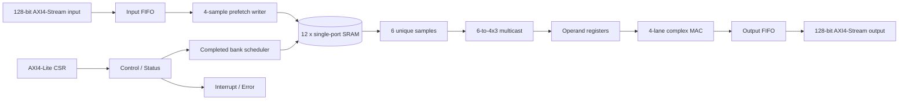

# アーキテクチャ／インターフェース仕様

## 1. Block構成

`bank_scheduler.sv`は完成済み中核として機能変更を禁止する。製品化logicはwrapper、address generator、FIFO、CSR、MAC、DFT controllerとして周囲に追加する。

## 2. Pipeline

| stage | 処理 | stall条件 |
|---|---|---|
| P0 | command、bank/address生成、prefetch dequeue | input不足、bank transition |
| P1 | synchronous SRAM read / write | MBIST、reset |
| P2 | 6 sample register、4×3同報 | operand register満杯 |
| P3-Pn | complex FMA sequence | compute busy |
| Po | FP32→FP16、flag生成 | output FIFO満杯 |
| Px | output AXI transfer | `m_axis_tready=0` |

stall時はready/validで前段へbackpressureを伝搬する。SRAM requestを発行した後はtransaction metadataを同じlatencyだけ遅延し、sampleとlane maskを再結合する。

## 3. AXI4-Stream input

| signal | width | direction | 定義 |
|---|---:|---|---|
| `s_axis_tdata` | 128 | in | sample 0が`[31:0]`、sample 3が`[127:96]` |
| `s_axis_tkeep` | 16 | in | byte-valid。通常`16'hffff` |
| `s_axis_tvalid` | 1 | in | producer valid |
| `s_axis_tready` | 1 | out | input FIFO受理可能 |
| `s_axis_tlast` | 1 | in | programmed row/tile終端との整合確認用 |
| `s_axis_tuser` | 8 | in | buffer、row boundary、error injection予約 |

inputはHaloとpaddingを含む物理座標順で供給する。coreは負座標を生成しない。

## 4. AXI4-Stream output

| signal | width | direction | 定義 |
|---|---:|---|---|
| `m_axis_tdata` | 128 | out | lane 0が`[31:0]`、lane 3が`[127:96]` |
| `m_axis_tkeep` | 16 | out | 最終部分issueのlane-validをbyte単位へ展開 |
| `m_axis_tvalid` | 1 | out | output valid |
| `m_axis_tready` | 1 | in | consumer ready |
| `m_axis_tlast` | 1 | out | tileの最終有効output beat |
| `m_axis_tuser` | 24 | out | `{transaction_id[15:0], fp_flags[3:0], lane_mask[3:0]}` |

`tvalid=1 && tready=0`の期間、全output signalは不変とする。

## 5. AXI4-Lite CSR

little-endian、32-bit aligned、single outstanding transactionを最低要件とする。

| offset | name | access | reset | 定義 |
|---:|---|---|---:|---|
| `0x000` | `ID` | RO | `0x4e423201` | `NB2` + product revision |
| `0x004` | `VERSION` | RO | `0x00010000` | major.minor.patch encoded |
| `0x008` | `CONTROL` | RW | 0 | bit0 START、bit1 ABORT、bit2 SOFT_RESET、bit8 IRQ_GLOBAL_EN |
| `0x00c` | `STATUS` | RO | 1 | bit0 IDLE、bit1 BUSY、bit2 DONE、bit3 ERROR、bit4 MBIST_DONE |
| `0x010` | `LOGICAL_WIDTH` | RW | 4 | 1以上、4 lane未満はmask |
| `0x014` | `HEIGHT` | RW | 1 | logical row数 |
| `0x018` | `PADDED_WIDTH` | RW | 12 | 12の正の倍数 |
| `0x01c` | `ROW_STRIDE_BYTES` | RW | 48 | input physical row stride |
| `0x020` | `COEFF0` | RW | 0 | complex binary16 |
| `0x024` | `COEFF1` | RW | 0 | complex binary16 |
| `0x028` | `COEFF2` | RW | 0 | complex binary16 |
| `0x02c` | `IRQ_ENABLE` | RW | 0 | DONE/ERROR/MBIST/FP |
| `0x030` | `IRQ_STATUS` | RW1C | 0 | interrupt pending |
| `0x034` | `FP_STATUS` | RW1C | 0 | NV/OF/UF/NX sticky |
| `0x038` | `ERROR_CODE` | RO | 0 | 最初のerrorを保持 |
| `0x03c` | `TRANSACTION_ID` | RW | 0 | output `tuser` tag |
| `0x040` | `MBIST_CONTROL` | RW | 0 | start/abort/mode |
| `0x044` | `MBIST_STATUS` | RO | 0 | pass/fail/bank |
| `0x048` | `MBIST_FAIL_ADDR` | RO | 0 | first failing address |

## 6. Control sequence

1. reset解除後`IDLE=1`を確認する。
2. width、height、padded width、stride、coefficient、transaction IDを設定する。
3. input/output FIFOとconsumerを準備する。
4. `START=1`を書き、coefficientをatomic commitする。
5. streamを転送する。coreはprogrammed寸法と`TLAST`を相互検査する。
6. 最終output handshake後`DONE`をsetし、必要ならIRQを発生する。
7. error時は新規requestを停止し、発行済みtransactionをdiscardせず安全点までdrainして`ERROR_CODE`を固定する。

## 7. Error code

| code | 意味 |
|---:|---|
| 1 | illegal CSR configuration |
| 2 | unexpected input `TLAST` |
| 3 | missing input `TLAST` |
| 4 | bank conflict assertion |
| 5 | FIFO overflow/underflow assertion |
| 6 | coefficient write while busy |
| 7 | MBIST failure |
| 8 | watchdog timeout |

errorはverificationで到達可能性と復帰手順を確認する。
