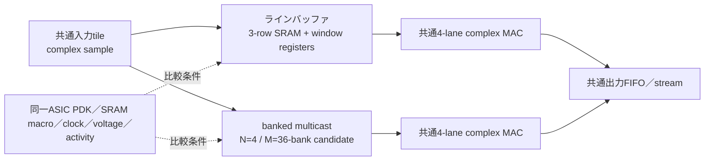

# ASIC参考比較：ラインバッファとbanked multicast

[English](asic-linebuffer-comparison.en.md) · [简体中文](asic-linebuffer-comparison.zh-Hans.md) · 日本語（正本）

この資料は、同じ`N=4`レーン・`M=36` bank候補・3×3・4-byte複素サンプルをASICへ置いた場合に、ラインバッファ方式とbanked multicast方式を同じ入力・演算・出力契約で比較するための参考モデルである。ここでは`N`をレーン数、`M`を物理SRAM bank数として表記する。ラインバッファRTL、共通PDKの配置配線、technology-calibrated power modelはまだないため、ここでの電力は絶対値を出さず、構造上の活動カウンタと測定条件だけを固定する。

## 比較境界

両方式で、入力tile、係数、FP16／複素MAC規則、`ready/valid`列、境界Halo、出力検査、clock、電圧、温度を固定する。single-port条件で比較する場合はラインバッファ側も同じ実効port予算へ制限し、true-dual-portを使う場合は両方式のポート数と電力を明記する。片側だけの追加portや片側だけの前処理は比較に含めない。

> **比較の置き方（保守的比較）**：ラインバッファ側は停止なし（backpressureなし）で同一条件の最適化を尽くした上限モデルを比較対象とする。本方式側はSRAM load、unique-read、multicast、bankスケジュールのコストを残した不利側に置く。したがって、ここで本方式が上限モデルへ近づく結果は「ラインバッファに対して有利な条件を隠していない」保守的な読み方であり、実装性能の保証ではない。

この「停止なし」は比較用の境界であり、ラインバッファが常に無停止という意味ではない。実装ではSRAM／BRAMのポート競合、line／row fill、tail／Halo境界、下流backpressureによってblocking／stallが発生し得る。以下の数値はその停止を含まない上限値なので、実ラインバッファのcycle数は増え、実効スループットは低下し得る。

本方式は、隣接窓の重複を利用できることを前提にする。また、load／computeの重畳や同一データ系列の複数passを成立させる場合は、処理中のactive buffer、次処理用のprefetch buffer、境界Haloを同時に確保するA/B ping-pong容量が必要になる。この容量・保持電力・リークは本方式のコストであり、上の活動カウンタや電力式へ自動的には含まれない。

## 1024×1024 referenceの活動カウンタ

以下は共通referenceを再生した値で、ASIC電力測定ではない。表のcycle／access数は、両方式とも規則区間を停止なし・backpressureなしで進めるreference上限値であり、ラインバッファ実装で起こり得るblocking／stallは含めない。`multicast_deliveries`はbanked側の固定配線先への配信数であり、ラインバッファ側のwindow-registerからMACへの配線活動はこのカウンタに含めない。

| 指標 | line-buffer | banked multicast | 位置づけ |
|---|---:|---:|---|
| 出力サンプル | 1,048,576 | 1,048,576 | 共通入力・共通演算 |
| storage reads | 2,097,152（2.000／output） | 4,718,592（4.500／output） | reference counter（停止なし上限） |
| storage writes | 1,054,728（1.006／output） | 1,054,728（1.006／output） | 共通入力streamの保持 |
| storage access合計 | 3,151,880（3.006／output） | 5,773,320（5.506／output） | 読書きの単純合計 |
| logical window values | 9,437,184（9.000／output） | 9,437,184（9.000／output） | 共通MAC入力数 |
| multicast deliveries | 0 | 9,437,184（9.000／output） | banked配線カウンタ |
| M（bank count） | 実装依存のline SRAM／window register | 36（2D候補） | 物理macro数ではない |
| core cycles | 262,145 | 262,145 | preload済み・停止なしのreference |
| end-to-end cycles | 263,683 | 525,827（load直列） | 停止なし上限。banked overlap上限は263,682 |

出力一致digest、入力条件、完全なカウンタは[asic-dataflow-reference-1024.json](../../physical/evidence/asic-dataflow-reference-1024.json)に保存する。生成スクリプトは[`tools/compare_asic_dataflows.py`](../../tools/compare_asic_dataflows.py)である。

## 電力の扱い

電力の絶対値は、次のtechnology-specific係数が揃うまで未確定である。

$$
E_{LB}=R_{LB}e_{SRAM\_read}+W_{LB}e_{SRAM\_write}+S_{LB}e_{window\_shift}+C e_{common}
$$

$$
E_{BM}=R_{BM}e_{SRAM\_read}+W_{BM}e_{SRAM\_write}+F_{BM}e_{multicast\_fanout}+C e_{common}
$$

ここで`C`は共通MAC／I/O／制御、`S_LB`はラインバッファのwindow-register移動、`F_BM`はbanked multicastの配線fan-outである。`e_*`はSRAM macro、標準セル、配線負荷、clock、電圧、PVT、activityから取得する。機能referenceだけでは`S_LB`と`F_BM`の電気的重みを決められないため、どちらが低電力かはまだ結論しない。

現行`N=4`／`M=12` bankの11.434 mWは、別のSKY130 OpenROAD探索runにおけるbanked ASICアンカーであり、ラインバッファの値でも、この2D比較の共通値でもない。2ユニット複製の22.868 mW試算も同じ理由で、この比較へ直接転記しない。

## 読み取れる範囲と次の境界

- reference上は、ラインバッファがSRAM readを少なくできる一方、banked multicastはセル間shiftを行わず固定fan-outで供給する、という交換関係が見える。
- どちらも同じcore出力率・最終結果を持つreferenceであり、電力効率の優劣、面積、Fmax、熱余裕は未検証である。
- ASIC比較を実測へ進めるには、ラインバッファRTLを追加し、同じSRAM macro／PDK／clock／voltage／SAIFまたはactivity、同じP&R制約でpower reportを取得する。
- 1ポートの無衝突性を設計の主題にする場合、ラインバッファの行SRAMアクセスもbank集合・port上限・window更新を明示的に検証する。2ポートmacroで成立させた結果は別ケースとして扱う。

FPGAでの同条件比較契約は[FPGA前提：ラインバッファ方式との客観比較](fpga-linebuffer-comparison.md)、電力測定方法の参考は[電力・データ移動の外部参考文献](energy-measurement-references.md)を参照する。
