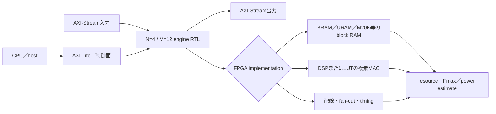
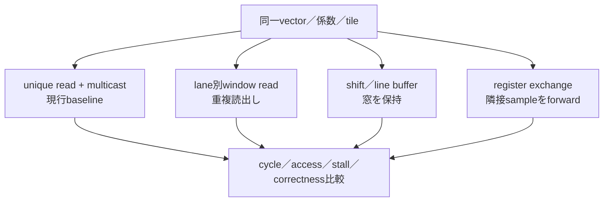

# FPGA適用可能性と比較シミュレーションの境界

[English](fpga-and-simulation-comparison.en.md) · [简体中文](fpga-and-simulation-comparison.zh-Hans.md) · 日本語（正本）

この付録は、現行の`N=4`／`M=12` baselineをFPGAへ移植した場合に何を確認できるか、また別方式とどの指標を比較できるかを整理する。ここでは`N`をレーン数、`M`を物理SRAM bank数として表記する。FPGA実装や比較モデルは将来の評価候補であり、現行の公開結果・`v0.3.0`の内容固定・製造sign-offには含めない。

## 1. FPGAで確認できる範囲

現行RTLは、ベンダ固有のSRAM macroを除けば、同期1-port SRAM、FIFO、multicast、複素MAC、AXI系インターフェースからなる。したがって、対象FPGAを固定すれば、次の値を同じRTLから取得できる。

| 確認項目 | FPGAで得られる値 | 現行の位置づけ |
|---|---|---|
| 論理移植 | compile／elaboration、reset、ready/valid、結果一致 | RTLで確認済み。vendor runは未実施 |
| メモリ推論 | block RAM数、幅・深さ、read-during-write規則 | デバイス／推論設定依存、未評価 |
| 演算資源 | DSP、LUT、FF、乗算器の推論結果 | デバイス依存、未評価 |
| タイミング | implementation後のFmax、setup／hold slack | 制約・配置依存、未評価 |
| スループット | `N=4`のcycle間隔を実clockへ換算した値 | cycle規約はRTL、実clockは未測定 |
| 電力 | vendor power estimatorまたは実測 | workload／ボード依存、未評価 |
| 外部メモリ | DDR／DMAのburst、latency、backpressure | 外部DMA wrapperは未実装 |

FPGAのFmaxや電力を取得しても、ASICのSKY130結果や製造可能性へ直接外挿しない。逆に、FPGAで未達でも、SRAM macro、配線、DSP配置が異なるASIC案の不成立を意味しない。

## 2. 方式比較のシミュレーション契約

ラインバッファ方式とのFPGA同条件比較を具体化した測定表は、[FPGA前提：ラインバッファ方式との客観比較](fpga-linebuffer-comparison.md)に分離している。

比較対象は同一の入力tile、係数、複素整数reference規則、出力検査を共有する。`tools/compare_2d_dataflows.py`がラインバッファ／banked multicastの2D referenceを同じ入力で再生し、最終出力digestを一致させる。方式ごとに前処理・境界・backpressureを変えると、方式差ではなく条件差になるため、まず規則区間の無ストールcaseを基準にする。

比較表では、ラインバッファを停止なし・同一条件で最適化した上限モデルとして置き、本方式をSRAM load／unique-read／multicastのコストを含む不利側に置く。この保守的な比較により、本方式のload／compute overlapは潜在的な上限として別記し、ラインバッファの最良ケースを下回る可能性を隠さない。

なお、ここでの停止なしは比較契約上の上限であり、ラインバッファ実装の無停止を保証しない。SRAM／BRAM／SRLのポート競合、line／row fill、tail／Halo境界、下流backpressureではblocking／stallが発生し得るため、比較表のcycle／throughput値はその停止を含まない注釈付きのreference値として読む。

本方式の重畳は無料ではない。隣接窓の規則的な重複に加え、複数passまたはload／compute overlapを成立させるにはactive／prefetchのA/B bufferとHalo領域を予約する必要があり、容量・保持電力・配線を比較へ含める。reference比較はこの予約容量を証明するものではない。

最低限そろえる指標は次のとおり。

- 入力handshakeからfirst outputまでのlatency、最終出力までのtransaction cycle
- 定常のoutput interval（II）、lane結果／cycle、window作成に要する追加cycle
- SRAM read／write数、unique sample数、bank conflict、multicast fan-out
- input／output FIFO occupancy、stall cycle、row境界・tailのbubble
- bit-exact結果、lane mask、`TLAST`、エラー／reset復帰

「シミュレーションが速い」は、シミュレータのwall-clock実行時間ではなく、同一clock条件でのcycle数を指す。Icarus等の実行時間は波形・モデル量の影響を受けるため、ハードウェア速度の比較表へ混ぜない。

## 3. 公開上の境界

- 現行baselineの主張は、`N=4`／`M=12`のreference、RTL、formal、探索的physical evidenceに限る。
- FPGA vendor synthesis、実ボード、外部DDR、他方式のRTLは独立した評価物であり、追加されるまで未評価とする。
- 比較モデルを追加する場合も、入力契約と測定スクリプトを固定し、baselineの数値を上書きしない。大サイズの再生は`python tools/compare_2d_dataflows.py --width 1024 --height 1024`で実行できる。
- FPGA実装を実施しない場合でも、本付録の表は「何を測定可能か」の境界を示すだけで、測定済みを意味しない。
