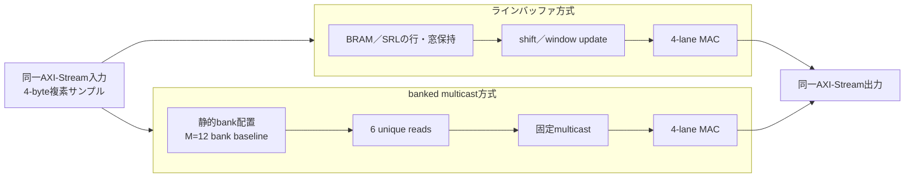

# FPGA前提：ラインバッファ方式との客観比較

[English](fpga-linebuffer-comparison.en.md) · [简体中文](fpga-linebuffer-comparison.zh-Hans.md) · 日本語（正本）

この資料は、3-tap／4-laneの同一ワークロードをFPGAへ実装する場合に、一般的なラインバッファ方式と本リポジトリのbanked multicast方式を同じ物差しで比較するための契約である。ここでは`N`をレーン数、`M`を物理SRAM bank数として固定し、現行1D baselineを`N=4`／`T=3`／`M=12`とする。`reference/two_d_dataflow.py`による2D出力一致シミュレーションは、4-byte複素サンプルを整数ペアで扱うreferenceとして実行可能である。FP16のbit-exact丸めは既存のRTL検証契約に分離している。比較用RTLと特定FPGAの配置配線はまだ実行していないため、資源・Fmax・電力の「傾向」は設計上の仮説である。

## 1. 比較する二つのデータ経路

ラインバッファ側は、窓をレジスタ／SRL／BRAMへ保持して隣接入力を更新する構成を指す。具体的な深さ、SRLとBRAMの分担、MACのpipeline段数は対象FPGAに合わせて固定する。本方式側は1Dの現行`N=4`／`T=3`／`M=12`をbaselineとし、2D referenceでは18 unique readを1サイクルに無衝突化する候補として`M=36`へ拡張する。入力FIFO・出力FIFO・係数・FP16丸め規則は両方式で共通化する。2Dの`M=36`モデルは現行RTLやFPGA実装の測定結果ではない。

## 2. 元データと入力契約

元データは、窓をあらかじめ展開した配列ではなく、同じ密な4-byte複素サンプル格子を両方式へ渡す。referenceでは値を整数の実部／虚部ペアとして保持し、窓生成を片方だけの前処理として数えることを避ける。FP16の丸め・例外規則を含める場合は、両方式へ同じFP16 adapterを接続して別途比較する。

| 比較レベル | 入力 | 演算の境界 |
|---|---|---|
| 1D機構比較 | row-majorの`W×H`格子。各行を`1×3` tapの独立ストリームとして供給 | 現行`N=4`／`M=12` engine。行端のHaloとtail規則を共通化 |
| 2D用途比較 | row-majorの`W×H`格子と1セルHaloを持つ共通tile。例：`3×3` stencil | ラインバッファは3行保持、本方式の2D拡張はrow-skew／multicastを別RTLで定義 |

入力生成は、同じseedのimpulse、ramp、有限乱数の3種類を最低限用意する。係数、境界（zero／replicate等）、有効出力座標、padding、`ready/valid`列は方式間で同一にする。実データを追加する場合も、まず共通adapterでこの入力契約へ正規化し、adapterのcycleを含むend-to-end比較と、coreだけの比較を分けて記録する。

## 3. FPGAでそろえる条件

| 条件 | 固定する内容 |
|---|---|
| デバイス | FPGA型番、speed grade、使用可能なBRAM／DSP／SRL資源 |
| ツール | vendor synthesis／place-and-routeの版、seed、retiming設定 |
| clock | 同一clock制約、同一I/O遅延、同一false-path／multicycle指定 |
| workload | `N=4`、`T=3`、4-byte複素サンプル、同一tile／Halo／係数、同一`ready/valid`列 |
| メモリ | 両方式とも同じsingle-portまたは同じtrue-dual-port条件。片方だけの追加portは禁止 |
| MAC | DSP推論を両方式で同じ許可条件にする。LUT実装との混在は禁止 |
| 検査 | bit-exact出力、lane mask、`TLAST`、reset、stall中の出力保持 |

FPGA BRAMが2ポートであっても、本方式のsingle-port bank条件を検証するケースでは、line-buffer側も同じ実効port予算に制限する。逆に、両方式をtrue-dual-portで比較する場合は、ポート数と消費電力を結果へ明記する。

> **比較の置き方（保守的比較）**：ラインバッファ側は停止なし（backpressureなし）で同一FPGA条件の最適化を尽くした上限モデルを比較対象とする。本方式側はSRAM load、unique-read、multicast、bankスケジュールのコストを残した不利側に置く。ラインバッファの最良ケースと、本方式のload直列化ケースを先に比較し、load／compute overlapは別の上限値としてのみ掲げる。

この「停止なし」は比較用の境界であり、ラインバッファ実装が常に無停止という意味ではない。BRAM／SRLのポート競合、line／row fill、tail／Halo境界、下流backpressureによってblocking／stallが発生し得る。以下のcycle／throughput数値はその停止を含まない上限値で、実装時のラインバッファは数値より遅くなり得る。

本方式は隣接窓の重複が規則的に存在することを利用する構成であり、重複の少ない不規則アクセスでは同じ削減を前提にしない。load／computeの重畳や複数passを使う場合は、active／prefetchのA/B bufferとHaloを同時に確保するため、BRAM／SRL容量・保持電力・配線資源を比較へ含める。referenceのcycle／access値だけではこの予約容量を表さない。

## 4. 比較指標

| 指標 | 算出方法 | 解釈 |
|---|---|---|
| 正しさ | 同一vectorの全出力、sideband、reset復帰 | 合否ゲート。速度より先に一致を確認 |
| first-output latency | 最初の入力acceptから最初の出力acceptまでのcycle | 窓初期化・pipeline深さの影響を含む |
| steady II | 規則区間の出力accept間隔（cycle/output beat） | backpressureなしで比較 |
| 有効lane throughput | `Fmax × 有効lane数 / II` | post-route Fmaxを使うまで未確定 |
| 入力帯域 | accept sample bytes／cycle | 外部DMA条件と分離 |
| オンチップ読出し | logical read、unique read、BRAM read port使用数 | 重複排除とport競合を比較 |
| 資源 | LUT、FF、BRAM、SRL、DSP、routing utilization | synthesis値ではなく同じP&R段で比較 |
| timing | worst slack、Fmax、high-fanout net数 | multicast配線とwindow更新の差を確認 |
| 電力 | 同一activityでvendor estimatorまたは実測 | idle bank／SRL toggleを含める |
| stall耐性 | input gap、output backpressure、FIFO occupancy | 規則区間の固定latencyとは別指標 |

シミュレータのwall-clock実行時間は比較指標にしない。シミュレーションではcycle数を比較し、FPGAでは配置配線後の`Fmax`を掛けて実時間へ換算する。

## 5. 期待されるトレードオフ（未測定）

| 観点 | ラインバッファ | banked multicast |
|---|---|---|
| 窓の更新 | shift／window updateのtoggleと配線が発生 | SRAMセル間のshiftを行わず、信号multicastで供給 |
| メモリ構成 | 少数BRAM＋SRLの混在が可能 | 1D baselineは12個、2D reference候補は36個の独立bankと固定bank mapping |
| 近傍重複 | 保持レジスタで再利用 | 1D baselineは6、2D reference候補は18 unique readを4 laneへ固定multicast |
| lane拡張 | window保持幅とread portの再設計が必要 | bank数、fan-out、multicast endpointが増加 |
| timingリスク | 窓更新とBRAM read latency | multicast fan-out、長いrouting、bank address生成 |
| 立ち上がり | line／window fillのprologue | SRAM loadとunique-window captureのprologue |
| FPGA適合性 | SRL／BRAM推論に依存 | BRAM bank推論と固定配線の品質に依存 |

この表から「どちらが常に速い／小さい」とは結論しない。特にFPGAでは、SRLが豊富なデバイスではラインバッファが有利になり、BRAM／routing／DSPの配置余裕があるデバイスではbanked multicastが有利になり得る。

## 5.1 何が同等で、どこが優位か

今回のreference比較で同等と確認する対象は、同じ入力・係数から同じ最終出力を生成することと、backpressureなしのcore規則区間における出力率である。`1024×1024`の再生では、両方式とも`262,145 cycle`のcoreモデルで、最終出力digestも一致した。これは本方式がラインバッファより常に高速という意味ではない。

| 観点 | 本方式（banked multicast） | ラインバッファ方式 |
|---|---|---|
| 主な優位 | 窓をシフト／再配置せず、unique sampleを固定multicastできる。帯域とデータ移動が厳しい規則区間で、load／compute重畳の余地を持つ | 行の連続再利用が単純で、SRL／BRAMが豊富なFPGAでは少ないメモリ構成で実装できる可能性がある |
| 速度の読み方 | preloadを直列化すると今回のモデルでは`525,827 cycle`で不利。重畳できる場合の上限は`263,682 cycle`で、ラインバッファの`263,683 cycle`相当 | 入力を流しながら行を埋め、同じcore出力率に到達するモデル。停止なしの比較では本方式との差は演算率ではなく供給経路にある |
| 未確定 | multicast fan-out、bank数、配線遅延、Fmax、電力 | shift／window更新のtoggle、SRL／BRAM配置、Fmax、電力 |

したがって、現時点で主張できる処理上の優位は「同じ演算結果を同じcore出力率で維持しつつ、窓の移動をデータ面から外せること」である。実際の高速化率、資源、電力の優劣は、同じFPGA型番・同じport条件でP&Rした結果で判定する。

## 6. 実行可能な比較手順

1. `tools/compare_2d_dataflows.py`で共通reference（ラインバッファ／banked multicast）を再生し、同じ入力vectorと係数で出力digestを一致させる。FPGAの実測へ進む場合は、この契約を保ったline-buffer RTLを追加する。
2. 両方式を同じ`ready/valid` testbenchで、`nostall`、入力gap、出力backpressure、row boundary、tailの順に再生する。
3. cycleログからfirst latency、II、read／write数、stall、FIFO occupancyを抽出し、bit-exact結果を合格条件にする。
4. 同じFPGA型番・constraint・tool versionでsynthesis後にP&Rし、LUT／FF／BRAM／SRL／DSP／Fmax／power estimateを並べる。
5. 方式差、デバイス差、tool seed差を分けて保存し、測定前の仮説表を結果表へ置き換える。

### 6.1 1024×1024 reference replay（完了）

`python tools/compare_2d_dataflows.py --width 1024 --height 1024`を実行し、同一の密な複素タイル、同一の3×3係数、4-laneで両方式を再生した。出力サンプル1,048,576個の最終digestは両方式で一致した。表のcycle値は停止なし・backpressureなしのreference上限であり、ラインバッファで起こり得るblocking／stall、FPGAのFmax、実時間は含まない。

| 指標 | line-buffer | banked multicast |
|---|---:|---:|
| 最終出力digest | `92f25b9ca748fe02a4d7d14a7fc0df7d36507f6af090dc1f25f175414de39ba9` | 同左 |
| 出力beat数 | 262,144 | 262,144 |
| end-to-end（loadを直列化） | 263,683 cycle | 525,827 cycle |
| coreのみ（SRAM preload済み） | 262,145 cycle | 262,145 cycle |
| load／compute overlapの上限 | — | 263,682 cycle |

完全な入力条件、アクセス数、bank conflict検査数は[2D比較JSON証跡](../../physical/evidence/2d-dataflow-comparison-1024.json)に保存している。

現行リポジトリで完了しているのはbanked multicast側の`N=4`／`M=12` reference／RTL／formalと、両方式の2D reference出力一致・cycle指標の基準化までである。line-buffer RTL、vendor P&R、実ボード、両方式のFPGA同一条件結果は未実装・未測定であり、現行baselineの性能保証には含めない。
