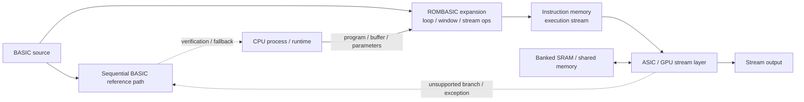

# ROMBASIC／GPU統合の参考案

[English](rombasic-gpu-integration.en.md) · [简体中文](rombasic-gpu-integration.zh-Hans.md) · 日本語（正本）

> [!NOTE]
> 本文書は将来の統合候補を保存する参考付録です。公開済み`N=4`／`M=12` baselineの必須構成でも、検証済み性能の主張でもありません。

## 1. BASIC採用の理由

BASICを採用する理由は、既存言語への懐古ではなく、処理系の正解系と並列化境界を小さく明示できるためである。逐次実行、代入、ループ、条件分岐、`GOTO` を少数の基本要素として持つため、CPU上の参照実装、命令ROM、ASIC／GPU側のストリーム実行を同じ記述から段階的に導出できる。

- **逐次意味論を保ちやすい**：CPU実行をゴールデンモデルとし、並列化後の結果を比較できる。
- **制御とデータ処理を分離しやすい**：分岐・例外・未対応命令はCPUに残し、規則的な配列・窓・バルク処理だけを委譲できる。
- **命令メモリへ収めやすい**：ループ本体をROM／命令メモリ上の実行列として保持し、毎要素の高価な解釈を避けられる。
- **既存資産を活かせる**：CPU、インタプリタ、コンパイラ、デバッガを参照系またはフォールバックとして利用できる。

したがって、BASICは最終的な性能言語ではなく、互換性を保った制御記述と検証基準である。性能はROMBASIC拡張が生成するストリーム処理層で得る。

## 2. ROMBASIC拡張の概念

ROMBASICはBASICをCPU上で毎データ要素ごとに解釈する処理系ではなく、BASICの逐次実行意味論を保ったまま、ループ本体を命令メモリ上の実行列へ展開する制御層である。CPU上のプロセスはプログラム、バッファ、係数、実行範囲を設定し、ROMBASICは処理開始時に命令列を供給する。データ要素ごとの解釈は行わず、展開済みの処理列をストリームとして流す。

概念上の記述例は次のようになる。

```basic
FOR x = 0 TO W - 1 STEP 4
  y = STENCIL3(WINDOW(x), COEFF)
  STREAM_OUT y
NEXT x
```



この拡張では、`WINDOW`、`BROADCAST`、`MAC`、`STREAM_IN`、`STREAM_OUT`、`WAIT` などを、通常の分岐・代入と同じ逐次命令列から呼び出せる。分岐、例外、未対応命令はCPU側の順次経路へ戻し、規則的な配列・ステンシル・バルク処理だけをストリーム実行層へ委譲する。したがって、BASICは互換性と正解系を担い、ROMBASIC拡張は並列化可能な処理範囲を明示する。

| 層 | 役割 |
|---|---|
| BASIC順次実行 | 参照意味論、分岐、例外、未対応処理 |
| ROMBASIC拡張 | ループ展開、窓生成、同報、ストリーム入出力の記述 |
| ASIC／GPU実行層 | 展開済みデータ処理の並列実行 |

## 3. GPU統合のアーキテクチャ案

本提案をGPUへ組み込む場合、GPUコマンドやドライバを新設するのではなく、既存GPUの実行層に1Dユニットを複製して接続する。CPU上のプロセス（または既存ランタイム）が命令列、バッファ、パラメータを設定し、GPU側のストリーム実行層へ処理を委譲する。ROMBASICは参照実装および制御記述として残し、GPU側で未対応の制御はCPUへフォールバックする。

GPU側の外部命令形式、ドライバ、ロード、スケジューリングは対象GPUの実装担当へ委譲する。本リポジトリが定義するのは、ROMBASICの意味論と、プログラム記述、バッファ記述、パラメータ、開始／完了／エラー同期という抽象的な接続契約だけである。したがって、CUDA／OpenCL等の特定APIに依存せず、既存GPUの外部命令機構へ適合させられる。

| 本リポジトリで固定するもの | GPU側で選択するもの |
|---|---|
| BASIC／ROMBASICの順次意味論とフォールバック | 外部命令フォーマット、ドライバ、ロード方式 |
| `WINDOW`、`BROADCAST`、`MAC`、ストリーム入出力の抽象動作 | lane／warpへの割り当て、occupancy、スケジューラ |
| バッファ、係数、実行範囲、同期の契約 | global／shared memory、DMA、キャッシュ経路 |

| 評価層 | 想定マッピング | 主な評価項目 |
|---|---|---|
| フラグシップ | SM/CUクラスタごとに複数の1Dユニットを配置し、HBMまたは大容量共有メモリへ接続 | スループット上限、メモリ帯域、ユニット複製効率 |
| ミドル | クラスタごとに1〜数ユニットを配置し、ディスパッチと局所SRAMを共有 | 実効スループット、帯域と面積の均衡 |
| エントリ | GPU内で1ユニットを共有、またはCPU/GPU混載で小容量バッファを使用 | 最小成立構成、転送・起動オーバーヘッド |

単位性能は、複製ユニット数を $U$、1ユニットの出力率を $R$（output/cycle）、1出力の演算量を $O$（FLOP/output）、動作周波数を $f$ として、$P_{peak}=UROf$ で上限を置く。実効値は演算上限だけでなく、メモリ帯域、命令供給、occupancy、分岐による停止を含めて評価する。ここでの3層比較はアーキテクチャ上の基準であり、特定GPUの実装結果やCUDA／OpenCLの性能保証ではない。

### 3.1 同一カーネルでのGPU比較（帯域上限）

比較条件は、複素FP16（1 complex sample = 32 bit）、3 tap、1出力あたり3 complex MAC = 24 FLOP、隣接窓の重複除去後のデータ移動10 byte/outputとする。この条件の算術強度は $I=24/10=2.4$ FLOP/byte であり、GPU側は `memory_bandwidth × I` を上限として計算する。GPU全体の理論帯域を使い切る仮定であり、実カーネルの起動、occupancy、共有メモリ、分岐、境界処理は含めない。

2026-08-29時点の同一GeForce系3層スナップショットは次のとおりである（帯域値は[NVIDIA公式比較表](https://www.nvidia.com/en-us/geforce/graphics-cards/compare/?section=compare-20)）。RTL側は100 MHz換算のMAC-4（3.2 GFLOP/s）およびSTENCIL-4相当（9.6 GFLOP/s）を基準にする。

| 層 | 代表GPU | 公称メモリ帯域 | 同条件の帯域roofline | MAC-4比 | STENCIL-4比 |
|---|---|---:|---:|---:|---:|
| フラグシップ | RTX 5090 | 1.792 TB/s | 4.30 TFLOP/s | 約1,344倍 | 約448倍 |
| ミドル | RTX 5070 | 672 GB/s | 1.61 TFLOP/s | 約504倍 | 約168倍 |
| エントリ | RTX 5060 | 448 GB/s | 1.08 TFLOP/s | 約336倍 | 約112倍 |

したがって、**この小規模RTLブロックをGPU全体の生スループットと比較すると、GPUが桁違いに上回る**。本提案の比較対象はGPU置換ではなく、GPUのglobal memoryからの重複読出しを減らし、shared／local bufferへ規則化されたストリームを供給する前段・補助層である。データ移動削減量、実効帯域、電力、起動オーバーヘッドを同じカーネルで測定して初めて、統合効果を主張できる。なお、データセンター上限の参考として、NVIDIA Rubin GPUは最大22 TB/sのHBM4帯域を公表しており、同じ仮定では52.8 TFLOP/sの帯域rooflineになるが、これは予備仕様であり本表の3層比較には含めない（[公式仕様](https://www.nvidia.com/en-eu/data-center/vera-rubin-nvl72/)）。

## 4. さらに探索的な拡張（本文の検証範囲外）

以下は初期アイデアの保存用メモであり、`N=4`基準、`N=16`検証候補、または本リポジトリの性能保証には含めない。

- Self-AttentionのKey／Value配信や全結合相関を、2D再同報網の接続候補として検討できる。ただし、実際には問題サイズに応じた演算器、交換、リダクション、Softmaxが必要であり、1 cycle完了を意味しない。
- 縦・横・再帰のフィードバックを組み合わせた「脳型ループ」は、制御とデータ再配信を考えるための比喩的な構想であり、収束性や最適性を主張しない。
- レーン数を大きくした任意`N`の実装は論理式から検討できるが、配線遅延、fan-out、SRAM容量、電力、クロックの実測が必要である。大規模構成はN-way候補を一つずつ独立に検証する。
