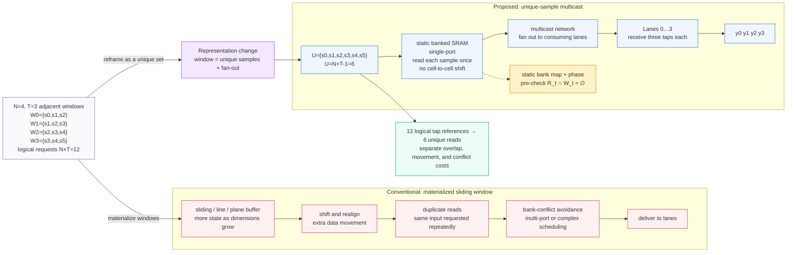
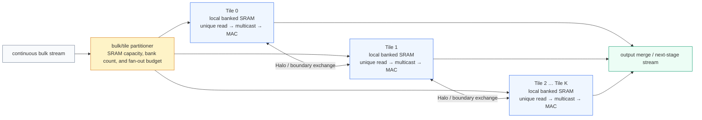

# Reframing the Stencil Window

> Japanese source: [stencil-window-reframing.md](stencil-window-reframing.md) 
> 简体中文: [stencil-window-reframing.zh-Hans.md](stencil-window-reframing.zh-Hans.md)

This note describes the data-path representation used by the repository's
measured `N=4` baseline. It does not change the stencil equation or claim that
every physical implementation can eliminate line or plane storage. The point
is to separate the logical overlap of neighboring windows from the physical
movement and delivery of their samples.

Here `N` always denotes lane count, `M` physical SRAM-bank count, and `T` tap
count. `N` and `M` are independent design parameters.

## 1. Why the window representation matters

Stencil operators occur in image processing, physical simulation, numerical
computing, and AI accelerators. A conventional materialized-window pipeline
keeps each lane-local window in a sliding, line, or plane buffer. Advancing the
window can then require shifts, alignment muxes, repeated reads, and bank-conflict
scheduling before the MAC stage.

For regular adjacent windows, the overlap is structural rather than new data.
The same input sample can be an operand for several neighboring outputs. The
alternative used here is to keep samples statically addressed in banked SRAM,
read each unique sample once, and multicast that value to every lane that
consumes it.

## 2. Concrete `N=4`, `T=3` example

Four adjacent lanes request the following three-tap windows:

| Lane | Input window |
|---|---|
| 0 | `{s0, s1, s2}` |
| 1 | `{s1, s2, s3}` |
| 2 | `{s2, s3, s4}` |
| 3 | `{s3, s4, s5}` |

The logical request count is `N*T = 12`, but the union contains only

$$
U=N+T-1=4+3-1=6
$$

unique samples. The `N=4`／`M=12` baseline reads those six samples once and
routes them to the four lanes. “No data movement” means no shift or relocation
between SRAM cells; SRAM reads and signal propagation still occur.

## 3. Two data-path representations

### Conventional materialized window

The conceptual sequence is:

`load -> align/shift -> window construction -> MAC`

The buffer state is updated as the window advances. Duplicate sample requests,
lane alignment, and bank-conflict avoidance appear as separate implementation
costs. Line and plane buffers remain valid implementation choices; they are not
being declared universally incorrect.

### Unique-sample multicast

The proposed data path uses:

1. Static placement in single-port banked SRAM; no cell-to-cell shift.
2. One read for each of the `U=N+T-1` unique samples required by the issue.
3. A multicast network that fans each SRAM output out to its consuming lanes.
4. Lane-local reconstruction of the tap operands followed by the MAC stage.

The window membership is therefore encoded by coordinates, bank mapping, and
read order rather than by materializing a shifted window buffer. The runtime
sequence is approximately:

`ordered SRAM read -> multicast -> MAC`

## 4. Representation comparison

## 5. What the speed figures mean

The figures below describe different observables and are not independent
multipliers.

| Effect | Comparison | Interpretation | Status |
|---|---|---|---|
| Lane utilization | 3 effective lanes/cycle → 4 | `4/3 = 133%` (+33%) ideal lane-rate ratio | Conditional first-order estimate |
| Issue interval | 2 cycles/issue → 1 | `2/1 = 2x` (+100%) steady-state throughput limit | Conditional theoretical upper bound |
| Data representation | `N*T=12` logical tap references → `U=6` physical reads | 50% fewer SRAM reads; each unique sample is reused through multicast | Measured for `N=4` |
| Window-formation front end | `load → align/shift → construction` → ordered read and multicast | Dedicated shift/alignment bubbles can be removed or overlapped | No matched conventional measurement |

The `2x` issue-interval statement assumes the same clock, lane/tap count, I/O
shape, and regular no-stall region, excluding DRAM waits, backpressure,
prologue/epilogue, and tail handling. It compares issue-to-issue spacing, not
zero pipeline latency or end-to-end tile latency. The two-cycle conventional
baseline is not measured in this repository.

The `12 -> 6` result is a physical-read reduction, not an additional `2x`
factor. A matched cycle model is needed before combining front-end savings with
the issue-interval model.

## 6. SRAM-fit bulk/tile partitioning

A large stream can be partitioned into tiles sized for the available SRAM,
bank count, and multicast fan-out. Each tile retains the same local
unique-sample read and multicast structure; only tile boundaries require Halo
exchange.

Partitioning is a scaling option, not a claim that every larger tile is faster.
Halo traffic, DMA behavior, merge latency, fan-out, timing, power, and capacity
are separate design variables.

## 7. Evidence boundary

- The measured baseline is `N=4`／`M=12`: reference, RTL, formal conflict checks,
  generic synthesis, and the documented RTL performance run.
- `N=6` is a first-order design-space estimate.
- `N=16` is a mathematical derivation under `T=3`, single-port SRAM, contiguous
  windows, ping-pong buffering, and a common row: `U=18`, `M=36`, and a phase
  difference of 18. It is not a 16-lane RTL or physical measurement.
- “Fixed latency” means deterministic latency inside a regular on-chip SRAM
  streaming region, excluding external DRAM waits and backpressure.
- Regular 2D/3D tiles can use the same set-based construction algebraically;
  concrete tile geometry, Halo supply, hierarchy, physical timing, and power
  remain outside the measured baseline.

Evidence links: [validation scope](../../VALIDATION.md), [RTL performance
report](../../physical/evidence/RTL-PERFORMANCE-REPORT.md), and [physical
verification report](../../physical/evidence/PHYSICAL-VERIFICATION-REPORT.md).
