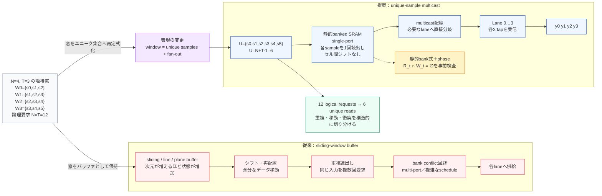
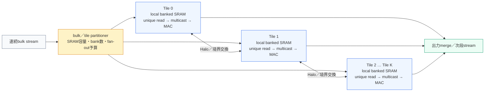

# ステンシル窓の再定式化

## Sliding-window buffer から unique-sample multicast へ

> 本稿は、リポジトリの実測 `N=4` baselineで用いるデータ表現を説明する
> 概念資料です。新しい検証結果や、すべての物理実装でline／plane storageを
> 省略できるという主張ではありません。集合化の定式化は、規則的な2D／3D
> tileへ代数的に拡張できます。

> English: [stencil-window-reframing.en.md](stencil-window-reframing.en.md) 
> 简体中文: [stencil-window-reframing.zh-Hans.md](stencil-window-reframing.zh-Hans.md)

ステンシル計算は、画像処理、物理シミュレーション、数値計算、AI向け
アクセラレータなどで繰り返し現れる基本操作です。各出力要素が周囲の
小さな入力窓に依存するため、計算式は単純でも、データの表現方法が
メモリ構成と配線量を大きく左右します。

この文書では、窓を「スライドするバッファ」として保持する見方と、窓を
「重複を除いたユニークサンプルの集合」として扱う見方を比較します。
後者では、論理的な重複要求を一度の読み出しとmulticastに分離できます。

## 1. 4-lane／3-tapの例

4つの隣接レーンが3-tap窓を同時に要求すると、論理上の要求は12個です。

| Lane | 入力窓 |
|---|---|
| 0 | `{s0, s1, s2}` |
| 1 | `{s1, s2, s3}` |
| 2 | `{s2, s3, s4}` |
| 3 | `{s3, s4, s5}` |

しかし、集合として必要なのは次の6サンプルだけです。

$$
U = \{s_0,s_1,s_2,s_3,s_4,s_5\},\qquad
|U| = N+T-1 = 4+3-1 = 6
$$

したがって、12個の論理tap要求をそのまま12回の物理読み出しにする必要は
ありません。6サンプルを一度ずつ読み出し、消費するレーンへ分岐すれば、
重複の扱いを読み出し側から配線側へ移せます。

## 2. 従来の見方：窓をスライディングバッファとして保持する

窓をバッファとして扱う実装では、次の状態を維持する必要があります。

- 次の窓へ進むたびに、入力要素をシフトまたは再配置する。
- 隣接窓に現れる同じ入力要素を、複数の要求として扱う。
- 2Dではline buffer、3Dではplane bufferなど、保持する状態を増やす。
- 同じcycleに要求が集中すると、multi-port SRAMや複雑なbank scheduleで
  衝突を回避する。

line bufferやmulti-port構成が常に不適切という意味ではありません。ここで
問題にしているのは、窓の重複をデータ移動と個別読出しとして表現すると、
重複、移動、bank競合が別々の付加コストとして現れる点です。

## 3. 再定式化：窓をユニークサンプル集合として扱う

隣接する`N`レーンと`T` tapの連続窓では、ユニークサンプル数は

$$
U=N+T-1
$$

です。提案するデータ面では、次の順序で処理します。

1. サンプルをSRAMセル間でシフトせず、banked SRAMへ静的に配置する。
2. そのcycleに必要な`U`個のユニークサンプルを各1回読み出す。
3. SRAM出力をmulticast配線で、サンプルを消費する複数レーンへ分岐する。
4. レーン側でそれぞれのtap窓を再構成して演算する。

### 実効lane数の比較（単純モデル）

従来側を「重複窓の処理によって実効3 lane／cycle」、本方式を
「4 lane／cycle」と置く単純な比較モデルでは、理想出力率は

$$
\frac{4}{3}=1.333\ldots
$$

となり、従来比133%（約33%向上）です。これは、サンプルを捨てることで
得られる差ではありません。隣接窓で再利用するサンプルを一度だけ読み出して
multicastし、重複読出し・シフト・bank衝突回避の処理を減らすことで、同じ
cycleに有効な出力を増やすというモデルです。従来方式との同条件RTL／実機
比較はまだ行っていないため、この133%は実測値ではなく一次試算として扱います。

比較条件は、同じクロック、lane／tap数、入出力形式を保ち、DRAM待ち、
backpressure、prologue／epilogue、tailを除く規則区間です。従来側の単純実装を
2 cycle／issue、本方式を1 cycle／issueと置く場合、定常スループットの
条件付き理論上限は次式です。

$$
S=\frac{C_{\mathrm{baseline}}}{C_{\mathrm{proposed}}}
 =\frac{2}{1}=2
$$

したがって、同条件のcycle間隔モデルでは従来比2倍（+100%）となります。
これはパイプライン初段のlatencyがゼロになるという意味ではなく、issue間隔が
2 cycleから1 cycleへ短縮されるという意味です。従来側の2 cycle／issueは
本リポジトリで測定した比較baselineではないため、この値は最大理論値の試算です。

### 速度差の内訳

ここでいう「2倍」の範囲は、DRAM待ち、backpressure、prologue／epilogue、
tailを含まない規則区間のissue-to-issue間隔です。tile全体のstart-upから
完了までが一律に2倍になるという意味ではありません。データ形式の変更に
よる効率化は、次のように別の指標として扱います。

| 効果 | 比較 | 指標 | 扱い |
|---|---|---|---|
| issue間隔の短縮 | 2 cycle／issue → 1 cycle／issue | 定常スループット2倍 | 条件付き最大理論値 |
| unique-sample化 | `N*T=12` logical tap要求 → `U=6` physical read | read数50%削減、同一sampleをmulticastで再利用 | `N=4`で確認済み |
| 窓形成の前段削減 | shift／再配置 → 静的SRAM＋multicast | 専用wait／bubbleを削除または他段と重畳 | 従来同条件比較は未実施 |

これらは異なる観測量です。issue間隔の2倍にread削減率や前段削減効果を
機械的に掛け合わせず、比較に含めるcycle範囲を明示したうえで別々に扱います。

従来のwindow materializationを含むデータ経路は、概念的には
`load → align／shift → window生成 → MAC`です。提案するデータ面では、
座標と並び順でwindowへの所属を決め、`ordered SRAM read → multicast → MAC`
とできます。したがって、12個の論理tap要求を6 readへまとめる効果に加えて、
windowを一時バッファへ組み立てるためのシフト、再配置、lane alignmentを
定常区間から外せます。前段cycleの削減量そのものは、従来実装との同条件比較を
用意すれば測定可能です。

現行の`N=4`／`T=3` baselineでは、12個の論理要求を6 readに圧縮し、
6本のデータを4レーンへ配送します。「データ移動ゼロ」はSRAMセル間の
シフト／再配置を行わないという意味であり、SRAM読み出しと配線上の
信号伝搬がなくなるという意味ではありません。

## 4. 表現の違い

図の要点は、ステンシル式そのものを変更することではありません。同じ
入力窓を、(a)重複を含むバッファ状態として移動させるか、(b)ユニークな
サンプルの集合として一度だけ読み出し、fan-outするかという表現の違いです。

### 単一tileからbulk／tile分割へ

ここまでの図は1つのtileを示しています。入力を一つの巨大な窓として
保持する代わりに、SRAM容量、bank数、配線fan-outの予算に合わせてbulkを
tileへ分割できます。各tileは局所的にunique-sample readとmulticastを行い、
隣接tileの境界だけをHaloとして交換する構成です。

この分割は定常部のデータ再利用と133%の単純モデルを保ったまま、容量と
配線規模を調整するための拡張軸です。tile境界のHalo、DMA、merge遅延は
別途評価対象です。

## 5. これまでに確認した課題

ここでいう「課題」は、ステンシル計算が不可能という意味ではなく、
窓をバッファとして実装したときに設計・検証コストとして現れたものです。
解消済みの範囲と、まだ残っている課題を分けて記載しています。

| 課題 | リポジトリで確認した状態 | 現在の扱い |
|---|---|---|
| 重複窓の読出し | `N=4`／`T=3`では論理12要求に対しunique readは6。有限17x3 tileではtailを含めて153→90 read | unique-sample化とmulticastで定常部を圧縮。tail／境界は別扱い |
| バッファのシフト／再配置 | sliding／line／plane bufferでは、窓を進めるたびに状態移動が必要 | 静的SRAM配置を採用。セル間シフトをしないことを主張 |
| single-port bank競合 | `N=4`の36周期状態と統合RTLでread/write conflict 0を確認 | `N=4`のreference／RTL／formal範囲で対処済み。大きな`N`は未検証 |
| 行端・Halo・部分lane | 全幅1〜257のreferenceで確認。外部controller側はtransition bubble固定で、部分lane maskが必要 | `N=4`のreference／RTL範囲で実装。異なる行のcontrollerは未完 |
| backpressure／外部DMA | stress RTLではoutput stall 8 cycleを観測。外部DMA wrapperと任意長トラフィックは未実装 | 固定遅延は規則区間・nostall前提に限定 |
| 配線・物理タイミング | SKY130探索runは4 MHz制約。hold WNS `-1.36 ns`、antenna 49 nets／59 pins、SRAM GDS stream-out停止を記録 | 探索的physical evidenceのみ。100 MHz sign-offやSRAM内部sign-offは未完 |
| 2D／3Dの構造 | 行・面の座標を加えたtile-localなunique-sample集合と再同報へ拡張可能 | tile形状、bank容量、Halo面、階層配線、RTL／P&R／電力は個別検証 |
| スケール時のfan-out／容量 | `N=6`は一次試算、`N=16`は前提付き数学的導出。直接配線とpyramidの比較は未実施 | レーン数ごとにRTL、formal、P&Rを独立検証 |

2D／3Dについては、窓の各座標を行・面のtile座標へ展開し、各tileで
`unique samples → multicast → lane／slice consumers`を構成すること自体は
数式で記述できます。したがって未解決なのは「構成が数学的に存在するか」
ではなく、具体的なtile寸法、bank容量、Halo面の供給、再同報トポロジー、
配線遅延、電力、RTL／formal／P&Rの実装証跡です。line／plane storageが
物理的に残る場合でも、重複窓をセル間で逐次シフトする必要はありません。

根拠は[検証範囲表](../../VALIDATION.md)、[RTL性能レポート](../../physical/evidence/RTL-PERFORMANCE-REPORT.md)、
[物理検証レポート](../../physical/evidence/PHYSICAL-VERIFICATION-REPORT.md)に固定しています。

## 6. 何が変わり、何が残るか

| 論点 | unique-sample multicastで変わる点 | 残る検証課題 |
|---|---|---|
| 窓の重複 | `N*T`要求を`U=N+T-1` readへまとめる | 不連続窓や境界窓では別スケジュールが必要 |
| データ移動 | SRAMセル間のシフト／再配置を避ける | DMA、FIFO、行切替、Halo投入は残る |
| bank競合 | 静的bank式とphaseで集合を事前検査する | 異なる行、可変アドレス、書戻しは個別検証が必要 |
| 配線 | 一度読んだ値を複数laneで共有する | fan-out、配線遅延、バッファ段数、電力は残る |
| 外部メモリ | 規則区間で読み出し回数と中間書戻しを抑える余地 | DRAM待ち、backpressure、帯域隠蔽はシステム条件依存 |

2D／3Dへの拡張は、行・面方向の座標を含むtile-localな集合へ同じ式を適用し、
静的配置と階層型multicastを組み合わせることで数学的に構成できます。
 line／plane storageを使う実装候補が残る場合でも、それは容量・帯域・
配線の選択であって、窓を逐次シフトすることが必須という意味ではありません。
未検証なのは、次元ごとの具体的なbank配置、Halo供給、RTL／formal、
fan-out、タイミング、電力、P&Rの証跡です。

## 7. このリポジトリでの位置づけ

- `N=4`／`M=12`の無衝突スケジューラ、RTL、formal、generic synthesisは
  [README](../../README.md)と[VALIDATION.md](../../VALIDATION.md)に記載した現行baselineです。
- `N=6`は一次試算、`N=16`は`U=18`・`M=36`・phase差18の前提付き数学的
  導出であり、16-lane RTLや実チップの実測ではありません。
- この文書は上記の数値を新たに保証するものではなく、なぜ重複窓を
  unique sampleへ再定式化するのかを説明するための補助文書です。
- 固定遅延は、backpressure、外部DRAM待ち、prologue／epilogueを除く
  規則区間の決定性レイテンシとして扱います。

## 言語別ドキュメント

- 日本語（この文書）
- [English version](stencil-window-reframing.en.md)
- [简体中文版本](stencil-window-reframing.zh-Hans.md)
