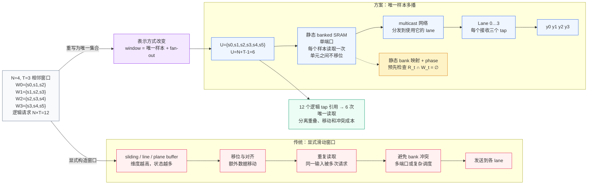
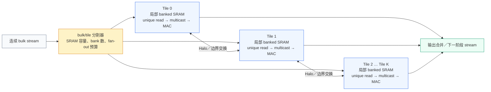

# 重新表述 Stencil 窗口

> 日本語: [stencil-window-reframing.md](stencil-window-reframing.md) 
> English: [stencil-window-reframing.en.md](stencil-window-reframing.en.md)

本文说明仓库中已测量的 `N=4` 基线所采用的数据路径表示方式。它不改变
stencil 方程，也不声称所有物理实现都可以取消 line buffer 或 plane buffer。
核心是把相邻窗口的逻辑重叠，与样本的物理移动和分发分开处理。

下文中 `N` 始终表示 lane 数，`M` 表示物理 SRAM bank 数，`T` 表示 tap
数；`N` 与 `M` 是彼此独立的设计参数。

## 1. 为什么窗口的表示方式重要

Stencil 运算广泛用于图像处理、物理仿真、数值计算和 AI 加速器。传统的
materialized-window（显式构造窗口）流水线，会用 sliding／line／plane buffer
保存每个 lane 的局部窗口。窗口前进时，通常还需要移位、对齐、重复读取和
bank 冲突调度，这些操作可能在 MAC 之前增加数据移动和 issue bubble。

对于规则的相邻窗口，重叠部分并不是新的数据。同一个输入样本可以同时作为
多个相邻输出的操作数。本方案将样本静态放置在 banked SRAM 中，每个唯一
样本只读取一次，再通过 multicast（多播）发送给所有需要它的 lane。

## 2. `N=4`、`T=3`具体例子

四个相邻 lane 请求以下三点窗口：

| Lane | 输入窗口 |
|---|---|
| 0 | `{s0, s1, s2}` |
| 1 | `{s1, s2, s3}` |
| 2 | `{s2, s3, s4}` |
| 3 | `{s3, s4, s5}` |

逻辑请求数为 `N*T = 12`，但并集只有

$$
U=N+T-1=4+3-1=6
$$

个唯一样本。已测量的 `N=4`／`M=12` 基线只读取这六个样本一次，再把它们
发送给四个 lane。“无数据移动”是指 SRAM 单元之间不进行移位或重新定位；
SRAM 读取和信号在线路上的传播仍然存在。

## 3. 两种数据路径表示

### 传统的显式窗口构造

概念上的顺序是：

`load -> align/shift -> window construction -> MAC`

窗口前进时需要更新 buffer 状态。重复样本请求、lane 对齐和 bank 冲突避免
会变成独立的实现成本。line／plane buffer 仍然是有效的实现选择；本文不
声称它们在所有场景下都不适用。

### 唯一样本多播

数据路径包含以下步骤：

1. 将样本静态放置在单端口 banked SRAM 中，不在单元之间移位。
2. 每个 issue 只读取所需 `U=N+T-1` 个唯一样本一次。
3. 用 multicast 网络把每个 SRAM 输出分发给使用它的 lane。
4. 在 lane 本地重建 tap 操作数，再进入 MAC 阶段。

因此，窗口归属由坐标、bank 映射和读取顺序编码，而不是由移位窗口 buffer
显式构造。运行时路径近似为：

`ordered SRAM read -> multicast -> MAC`

## 4. 表示方式对比

## 5. 速度数字的含义

下列数字对应不同的观测量，不能直接相乘：

| 效果 | 比较 | 含义 | 状态 |
|---|---|---|---|
| lane 利用率 | 每 cycle 3 个有效 lane → 4 个 | 理想 lane 速率 `4/3 = 133%`（+33%） | 有条件的一阶试算 |
| issue 间隔 | 2 cycle／issue → 1 | 稳态吞吐上限 `2/1 = 2x`（+100%） | 有条件的理论上限 |
| 数据表示 | `N*T=12` 个逻辑 tap 引用 → `U=6` 次物理读取 | SRAM 读取量减少 50%，唯一样本通过 multicast 复用 | `N=4` 已测量 |
| 窗口构造前端 | `load → align/shift → construction` → 有序读取和 multicast | 可去除或重叠专用移位／对齐 bubble | 没有同条件传统实现测量 |

2 倍只表示规则区间内的 issue-to-issue 间隔比较；同一时钟、lane／tap 数和
I/O 形式成立，并排除 DRAM 等待、backpressure、prologue／epilogue 和 tail。
它不是零流水线延迟，也不是整个 tile 的端到端延迟。传统侧的 2 cycle／issue
目前不是本仓库的实测基线。

## 6. 按 SRAM 容量进行 bulk／tile 分割

大规模数据流可以按照 SRAM 容量、bank 数和 multicast fan-out 预算分割成
多个 tile。每个 tile 保持局部的 unique-sample read 和 multicast 结构，只有
tile 边界需要 Halo 交换。

分割是扩展选项，不表示更大的 tile 一定更快。Halo 流量、DMA 行为、合并
延迟、fan-out、时序、功耗和容量都是独立的设计变量。

## 7. 证据边界

- 已测量基线为 `N=4`／`M=12`：reference、RTL、formal 冲突检查、generic
  synthesis 以及文档化的 RTL 性能运行。
- `N=6` 是一阶设计空间试算。
- `N=16` 是在 `T=3`、单端口 SRAM、连续窗口、ping-pong buffer、同一行的
  前提下得到的数学推导：`U=18`、`M=36`、phase 差为18；不是16-lane RTL
  或物理测量。
- “固定延迟”仅指规则的片上 SRAM streaming 区间内的确定性延迟，不包括
  外部 DRAM 等待和 backpressure。
- 规则 2D／3D tile 可以代数地采用相同的集合构造；具体 tile 几何、Halo
  供给、层次连接、物理时序和功耗不在已测量基线内。

证据链接：[验证范围](../../VALIDATION.md)、[RTL 性能报告](../../physical/evidence/RTL-PERFORMANCE-REPORT.md)、
[物理验证报告](../../physical/evidence/PHYSICAL-VERIFICATION-REPORT.md)。
